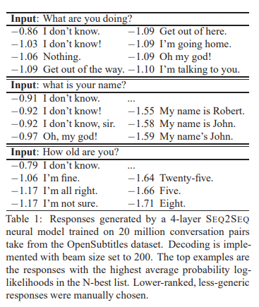
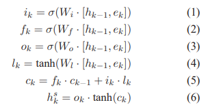
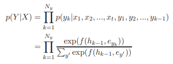
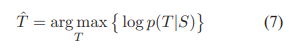
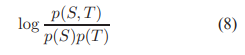
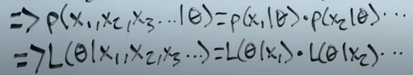
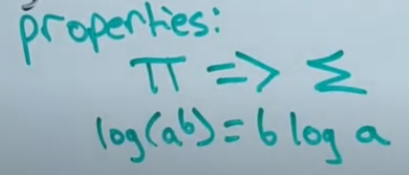
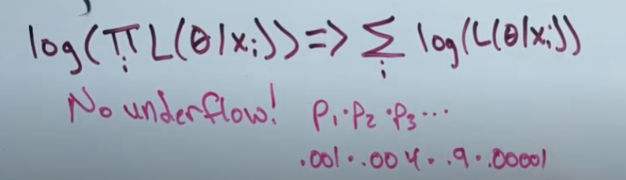
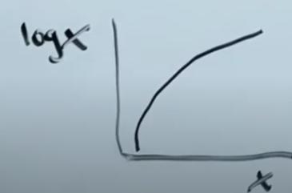

Link
===============

https://arxiv.org/pdf/1510.03055.pdf

Notes
===============

1. SEQ2SEQ models offer the promise of scalability and language-independence, together with the capacity to implicitly
   learn semantic and syntactic relations between pairs, and to capture contextual dependencies (Sordoni et al., 2015)
   in a way not possible with conventional statistical machine translationSMT approaches.
2. In practice, however, neural conversation models tend to generate trivial or non-committal responses
   
   this behavior can be ascribed to the relative frequency of generic responses like I don’t know in conversational
   datasets, in contrast with the relative sparsity of more contentful alternative responses.1
3. It appears that by optimizing for the likelihood of outputs given inputs, neural models assign high probability to
   “safe” responses. This objective function, common in related tasks such as machine translation, may be unsuited to
   generation tasks involving intrinsically diverse outputs. Intuitively, it seems desirable to take into account not
   only the dependency of responses on messages, but also the inverse, the likelihood that a message will be provided to
   a given response.
4. Seq-to-seq model:
   
   
5. MML Models/Method
    1. Notation
        1. In the response generation task, let S denote an input message sequence (source) S = {s1, s2, ..., sNs }
           where Ns denotes the number of words in S. Let T (target) denote a sequence in response to source sequence S,
           where T = {t1, t2, ..., tNt , EOS}, Nt is the length of the response (terminated by an EOS token) and t
           denotes a word token that is associated with a D dimensional distinct word embedding et . V denotes
           vocabulary size.
    2. Criterion
        1. 
        2. In MMI, parameters are chosen to maximize (pairwise) mutual information between the source S and the target
           T: 
        3.

Thoughts
===============

1. why seq-to-seq neural network models for generation of conversational responses tend to give blend response (I don't
   know) and how frequent is it?
2. intrinsically diverse outputs might need creativity or anything else?
    1. When will people give blender answer? when people are not willing to speak, when people are feeling boring. when
       people don't know the answer. It is not only the message will influence the response or in reverse. The speakers'
       states or environment should still be able to influence the response generation
3. The neural network is just a huge statistic data-driven model.
4. Commonly, input and output use different LSTMs with separate compositional parameters to capture different
   compositional patterns.
    1. there are so many parameters in a model, why we still need more layers or separate LSTMS to capture different
       patterns? Although we say a neural network is a large decision making process. Is it exactly the same procsss or
       something is different?
5. given that the variables are independent to each other:
    1. 
6. likelihood is how likely certain model have parameter value given some data
7. log likelihood is just the log of likelihood. There are two properties by using log:
    1. product turns to sum / exponent turns to product 
        1. The reason why we truns the product to sums is because the probabilities are so small that multipling them
           will quickly make the probability to zero v. Product and sum actually takes the same
           rules here. They both enable two models to compare their values with each other. By visiualing the graph:
           
8. Maximum likelihood estimation (MLE) finds parameters that best fits the data given. Estimator is a function (any
   function) that finds a maximum likelihood. Derivative is the slope of a curved line at certain point. When a function
   is at a minimum or maximum, then the slope(derivative) is at zero 0. So we can look for all the slope 0 point and get
   the maximum y with given x, and that point is maximum likelihood.

Summary
===============