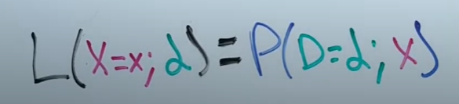

Link
===============

A Diversity-Promoting Objective Function for Neural Conversation Models
https://arxiv.org/pdf/1510.03055.pdf

ArgMax and SoftMax
https://www.youtube.com/watch?v=KpKog-L9veg

An introduction to mutual information
https://www.youtube.com/watch?v=U9h1xkNELvY

Notes
===============

1. SEQ2SEQ models offer the promise of scalability and language-independence, together with the capacity to implicitly
   learn semantic and syntactic relations between pairs, and to capture contextual dependencies (Sordoni et al., 2015)
   in a way not possible with conventional statistical machine translationSMT approaches.
2. In practice, however, neural conversation models tend to generate trivial or non-committal responses
   
   this behavior can be ascribed to the relative frequency of generic responses like I don’t know in conversational
   datasets, in contrast with the relative sparsity of more contentful alternative responses.
3. It appears that by optimizing for the likelihood of outputs given inputs, neural models assign high probability to
   “safe” responses. This objective function, common in related tasks such as machine translation, may be unsuited to
   generation tasks involving intrinsically diverse outputs. Intuitively, it seems desirable to take into account not
   only the dependency of responses on messages, but also the inverse, the likelihood that a message will be provided to
   a given response.
4. Seq-to-seq model:
   
   
   where f(hk−1, eyk) denotes the activation function between hk−1 and eyk , where hk−1 is the representation output
   from the LSTM at time k − 1. Each sentence concludes with a special end-of-sentence symbol EOS. Commonly, input and
   output use different LSTMs with separate compositional parameters to capture different compositional patterns.
5. MML Models/Method
    1. Notation
        1. In the response generation task, let S denote an input message sequence (source) S = {s1, s2, ..., sNs }
           where Ns denotes the number of words in S. Let T (target) denote a sequence in response to source sequence S,
           where T = {t1, t2, ..., tNt , EOS}, Nt is the length of the response (terminated by an EOS token) and t
           denotes a word token that is associated with a D dimensional distinct word embedding et . V denotes
           vocabulary size.
    2. Criterion
        1. 
           In MMI, parameters are chosen to maximize (pairwise) mutual information between the source S and the target
           T:  This avoids favoring responses that unconditionally enjoy high probability, and
           instead biases towards those responses that are specific to the given input.
           
           The MMI objective can write as follows:
           
           We use a generalization of the MMI objective which introduces a hyperparameter λ that controls how much to
           penalize generic responses
           
           An alternate formulation of the MMI objective uses Bayes’ theorem
           
           Thus:
           
6. MMI-antiLM
    1. The second term of log p(T|S)−λ log p(T) functions as an anti-language model. It penalizes not only
       high-frequency, generic responses, but also fluent ones and thus can lead to ungrammatical outputs. In theory,
       this issue should not arise when λ is less than 1, since ungrammatical sentences should always be more severely
       penalized by the first term of the equation, i.e., log p(T|S). In practice, however, we found that the model
       tends to select ungrammatical outputs that escaped being penalized by p(T|S).
    2. Solution Again, let Nt be the length of target T. p(T) in Equation 9 can be written as:
       
       We replace the language model p(T) with U(T), which adapts the standard language model by multiplying by a weight
       g(k) that is decremented monotonically as the index of the current token k increases:
       
       First, neural decoding combines the previously built representation with the word predicted at the current step.
       As decoding proceeds, the influence of the initial input on decoding (i.e., the source sentence representation)
       diminishes as additional previously-predicted words are encoded in the vector representations. In other words,
       the first words to be predicted significantly determine the remainder of the sentence. Penalizing words predicted
       early on by the language model contributes more to the diversity of the sentence than it does to words predicted
       later. Second, as the influence of the input on decoding declines, the influence of the language model comes to
       dominate.
    3. We adopt the most straightforward form of g(k) by setting up a threshold (γ) by penalizing the first γ words
       where  The objective in Equation 9 can thus be rewritten as: 
       where direct decoding is tractable.
7. MMI-bidi
    1. Direct decoding from (1 − λ) log p(T|S) + λ log p(S|T) is intractable, as the second part (i.e., p(S|T)) requires
       completion of target generation before p(S|T) can be effectively computed. Due to the enormous search space for
       target T, exploring all possibilities is infeasible.
8. Training
    1. Recent research has shown that deep LSTMs work better than single-layer LSTMs for SEQ2SEQ tasks
       (Vinyals et al., 2015; Sutskever et al., 2014). We adopt a deep structure with four LSTM layers for encoding and
       four LSTM layers for decoding, each of which consists of a different set of parameters. Each LSTM layer consists
       of 1,000 hidden neurons, and the dimensionality of word embeddings is set to 1,000. Other training details are
       given below:
        1. LSTM parameters and embeddings are initialized from a uniform distribution in [−0.08, 0.08]. • Stochastic
           gradient decent is implemented using a fixed learning rate of 0.1. • Batch size is set to 256. • Gradient
           clipping is adopted by scaling gradients when the norm exceeded a threshold of 1.
        2. Our implementation on a single GPU processes at a speed of approximately 600-1200 tokens per second on a
           Tesla K40.
9. Experiments
   1. Twitter Conversation Triple Dataset, OpenSubtitles dataset

Thoughts with Additional Information
===============

1. why seq-to-seq neural network models for generation of conversational responses tend to give blend response (I don't
   know) and how frequent is it?
2. intrinsically diverse outputs might need creativity or anything else?
    1. When will people give blender answer? when people are not willing to speak, when people are feeling boring. when
       people don't know the answer. It is not only the message will influence the response or in reverse. The speakers'
       states or environment should still be able to influence the response generation
3. The neural network is just a huge statistic data-driven model.
4. Commonly, input and output use different LSTMs with separate compositional parameters to capture different
   compositional patterns.
    1. there are so many parameters in a model, why we still need more layers or separate LSTMS to capture different
       patterns? Although we say a neural network is a large decision making process. Is it exactly the same procsss or
       something is different?
5. given that the variables are independent to each other:
    1. 
6. likelihood is how likely a model have certain parameter value given some data.
    1. This is equal to the probability of we get some data if we know the model  
    2. likelihood describe the odds that models fits our expectation. (model fits data)
    3. probability describe the change we get the data given the model. (data fits model)
       
7. log likelihood is just the log of likelihood. There are two properties by using log:
    1. product turns to sum and exponent turns to product 
        1. The reason why we truns the product to sums is because the probabilities are so small that multipling them
           will quickly make the probability to zero v. Product and sum actually takes the same
           rules here. They both enable two models to compare their values with each other. By visiualing the graph:
           
8. Maximum likelihood estimation (MLE) finds parameters that best fits the data given. Estimator is a function (any
   function) that finds a maximum likelihood. Derivative is the slope of a curved line at certain point. When a function
   is at a minimum or maximum, then the slope(derivative) is at zero 0. So we can look for all the slope 0 point and get
   the maximum y with given x, and that point is maximum likelihood.
9. Bayes' Theorem
    1. 
    2. 
    3. 
    4. 
    5. 
10. argmax and softmax layers are helping to interpret the result if the outputs are more than 1. Because when the
    outputs have more than 1 value. It is hard to interpret the result according to the output value. For example, if we
    say the value close to 1 is the answer, maybe it is wrong because the output value might be greater than 0 or be
    negative.
    1. argmax: set the largest value be 1 and all the others be 0. The only problem with ArgMax is that we can't use it
       to optimize the Weights and Biases in the Neural Network. This is because the output values from ArgMax are
       constants, 0 and 1.
       
       if we plug 0 into Gradient Descent, we won't step towards the optimal parameter values. And that means we can't
       use ArgMax for backpropagation.
    2. when people want to use ArgMax for output, they often use SoftMax for training.
       
11. Mutual information
    1. 
       mutual information is a way to calculate the dependence of two variables
       
    2. For log, if there is no base, we always assume the base is 10.
       
12. Why as the decoding proceeds, the influence of the initial input on decoding diminishes as additional
    previously-predicted words are encoded in the vector representations. In other words, the first words to be
    predicted significantly determine the remainder of the sentence.
    1. Is it possible to generate a sentence from the back?
13. log A + log B = log (AB)    log(a) - log(b) = log(a/b)   log(a) + log(b) - log(c)= log(ab/c)
14. 

Summary
===============