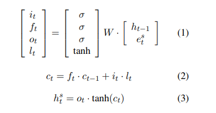
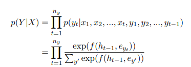
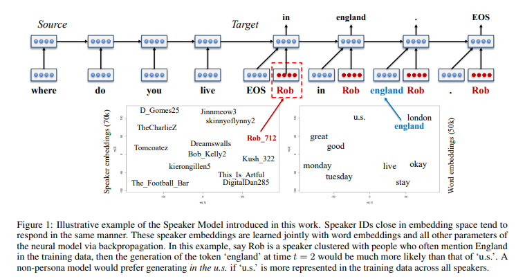
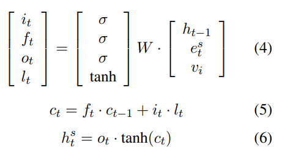
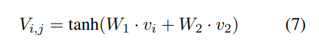
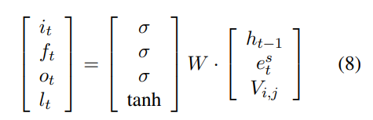
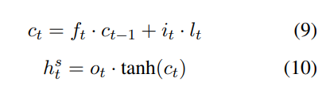
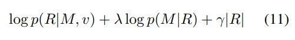
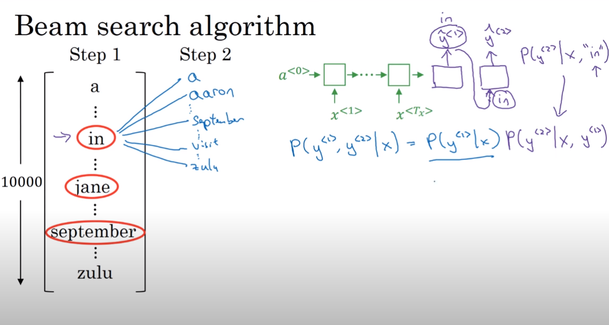
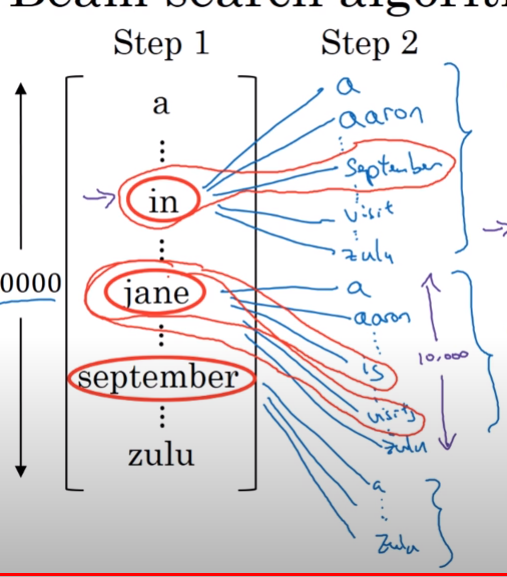

Link
===============

https://arxiv.org/pdf/1603.06155.pdf

Notes
===============

1. A persona can be viewed as a composite of elements of identity (background facts or user profile), language behavior,
   and interaction style.
2. The Speaker Model integrates a speaker-level vector representation into the target part of the SEQ2SEQ model.
   Analogously, the Speaker-Addressee model encodes the interaction patterns of two interlocutors by constructing an
   interaction representation from their individual embeddings and incorporating it into the SEQ2SEQ model. These
   persona vectors are trained on human-human conversation data and used at test time to generate personalized responses
3. The SMT model proposed by Ritter et al., on the other hand, is end-to-end, purely data-driven, and contains no
   explicit model of dialog structure; the model learns to converse from human-to-human conversational corpora.
4. Again, the model uses seq-to-seq models
   
   
5. Our work introduces two persona-based models:
   the Speaker Model, which models the personality of the respondent, and the Speaker-Addressee Model which models the
   way the respondent adapts their speech to a given addressee — a linguistic phenomenon known as lexical entrainment (
   Deutsch and Pechmann, 1982).
6. Speaker Model:
    1.  Each speaker i ∈ [1, N] is associated with a user-level representation vi ∈ R K×1 . As in
       standard SEQ2SEQ models, we first encode message S into a vector representation hS using the source LSTM. Then
       for each step in the target side, hidden units are obtained by combining the representation produced by the
       target LSTM at the previous time step, the word representations at the current time step, and the speaker
       embedding vi:
       
    2. Another useful property of this model is that it helps infer answers to questions even if the evidence is not
       readily present in the training set. This is important as the training data does not contain explicit information
       about every attribute of each user. The model learns speaker representations based on conversational content
       produced by different speakers, and speakers producing similar responses tend to have similar embeddings,
       occupying nearby positions in the vector space. This way, the training data of speakers nearby in vector space
       help increase the generalization capability of the speaker model. For example, consider two speakers i and j who
       sound distinctly British, and who are therefore close in speaker embedding space. Now, suppose that, in the
       training data, speaker i was asked Where do you live? and responded in the UK. Even if speaker j was never asked
       the same question, this answer can help influence a good response from speaker j, and this without explicitly
       labeled geo-location information.
7. Speaker-Addressee Model
    1. A natural extension of the Speaker Model is a model that is sensitive to speaker-addressee interaction patterns
       within the conversation. Indeed, speaking style, register, and content does not vary only with the identity of
       the speaker, but also with that of the addressee.
    2. We wish to predict how speaker i would respond to a message produced by speaker j. Similarly to the Speaker
       model, we associate each speaker with a K dimensional speaker-level representation, namely vi for user i and vj
       for user j. We obtain an interactive representation Vi,j ∈ R K×1 by linearly combining user vectors vi and vj in
       an attempt to model the interactive style of user i towards user j,. where W1, W2 ∈ R K×K.
       Vi,j is then linearly incorporated into LSTM models at each step in the target:
       
       Vi,j depends on both speaker and addressee and the same speaker will thus respond differently to a message from
       different interlocutors.
8. Decoding and Reranking
    1. For decoding, the N-best lists are generated using the decoder with beam size B = 200. We set a maximum length of
       20 for the generated candidates. Decoding operates as follows: At each time step, we first examine all B × B
       possible next-word candidates, and add all hypothesis ending with an EOS token to the N-best list. We then
       preserve the top-B unfinished hypotheses and move to the next word position.
    2. To solve the generic and commonplace response issue, reranking the generated N-best list using a scoring function
       that linearly combines a length penalty and the log likelihood of the source given the target:
       
       where p(R|M, v) denotes the probability of the generated response given the message M and the respondent’s
       speaker ID. |R| denotes the length of the target and γ denotes the associated penalty weight. We optimize γ and λ
       on N-best lists of response candidates generated from the development set using MERT (Och, 2003) by optimizing
       BLEU. To compute p(M|R), we train an inverse SEQ2SEQ model by swapping messages and responses. We trained
       standard SEQ2SEQ models for p(M|R) with no speaker information considered.
9. Datasets:
    1. Twitter Persona Dataset
    2. Twitter Sordoni Dataset
    3. Television Series Transcripts
10. Experiments:
    1. Evaluation:
        1. Following (Sordoni et al., 2015; Li et al., 2016)
           we used BLEU (Papineni et al., 2002) for parameter tuning and evaluation. BLEU has been shown to correlate
           well with human judgment on the response generation task, as demonstrated in (Galley et al., 2015). Besides
           BLEU scores, we also report perplexity as an indicator of model capability.
    2. Baseline

Thoughts
===============

1. It is really hard to mimic a human's talking behavior, but that is not important because a book character's
   personality is not complete as well in the book, it is extremely hard to completely regenerate the whole character.
   the key point of showing a book character is to by speaking out its story vividly.
2. By integrating persona improves BLEU score, why?
    1. because there are a lot of hidden properties under the dialogues, by explicitly integrating those properties
       could probabliy improve the performance of chatbot.
3. inputs and outputs use different LSTMs with separate parameters to capture different compositional patterns.
    1. what does this mean?
4. Dot Product:
    1. 
       
5. By using an embedding to represent a user, combining user embeddings with seq-to-seq model and generate a more user
   information related question. User produces similar responses tend to have similar embeddings. so the training data
   of speakers nearby in vector space help increase the generalization capability of the speaker model. How exactly did
   the training data increase the generalization capability?
    1. the response is generated by using user embedding with the previous context. After training the model, we are
       able to represent a user from England with a certain embedding. While a user live in London, who are also from
       England are also represented by a very similar embedding. Even they have similar embeddings, they actually can
       show different information. So is that mean, if the user have similar embeddings, the related information through
       all the training dataset could be used appropriately?
6. character stories are unique, so we can't use similar method to represent the information of different character. The
   two main questions remaining are:
    1. how to have longer, richer character persona
    2. how to make the persona unique (not affected by other persona in the training dataset)
7. Beam Search
    1. beam width: the number of output to consider in each word chosen process.
    2. 
    3. 
    4. remember the top 3 results, use the 3 results as the x1 to calculate the second results separately with all other
       words in the vocabulary. If we have 10000 words. We choose 3 words at the beginning and calculate 10000 x 3 times
       with all the other words in vocabulary. After that, we get the top 3 results again and redo the process until the
       end token is generated. If only one result has end token, then we keep that result and extend the other two
       results further until all the results meet a end token and we compare the possibilities and get the highest.
8. For searching, because the training dataset is composed of all kinds of people's dialogue or conversation style.
   maybe most of the answers are "I don't know", so it's hard to generate the answer according to possibilities. One of
   the main clues is the human's conversations are usually short and without explicit persona noted. So probably using
   book as new training dataset could let model do a better job on output searching result?
9. Seems like the beam search cannot solve the generic and commonplace responses issue.
10. Unexpected details are the keys

Summary
===============
