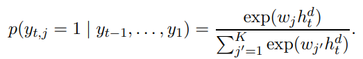

Link
===============

https://arxiv.org/pdf/1801.07243.pdf

Notes
===============

1. Common issues with chit-chat models include:
    1. the lack of a consistent personality
    2. the lack of an explicit long-term memory as they are typically trained to produce an utterance given only the
       recent dialogue history
    3. a tendency to produce non-specific answers like "I don’t know"
2. The PERSONA-CHAT Dataset collection consists of three stages:
    1. Personas: we crowdsource a set of 1155 possible personas, each consisting of at least 5 profile sentences,
       setting aside 100 never seen before personas for validation, and 100 for test.
    2. Revised personas: to avoid modeling that takes advantage of trivial word overlap, we crowdsource additional
       rewritten sets of the same 1155 personas, with related sentences that are rephrases, generalizations or
       specializations, rendering the task much more challenging.
        1. A difficulty when constructing dialogue datasets, or text datasets in general, is that in order to encourage
           research progress, the task must be carefully constructed so that is neither too easy nor too difficult for
           the current technology. One issue with conditioning on textual personas is that there is a danger that humans
           will, even if asked not to, unwittingly repeat profile information either verbatim or with significant word
           overlap. To alleviate this problem, we presented the original personas we collected to a new set of
           crowdworkers and asked them to rewrite the sentences so that a new sentence is about “a related
           characteristic that the same person may have”, hence the revisions could be rephrases, generalizations or
           specializations. For example “I like basketball” can be revised as “I am a big fan of Michael Jordan” not
           because they mean the same thing but because the same persona could contain both.
           
    3. Persona chat: we pair two Turkers and assign them each a random (original) persona from the pool, and ask them to
       chat. This resulted in a dataset of 162,064 utterances over 10,907 dialogs, 15,602 utterances (1000 dialogs) of
       which are set aside for validation, and 15,024 utterances (968 dialogs) for test.
3. Evaluation
    1. We consider this in four possible scenarios:
       conditioning on no persona, your own persona, their persona, or both. These scenarios can be tried using either
       the original personas, or the revised ones. We then evaluate the task using three metrics: (i) the log likelihood
       of the correct sequence, measured via perplexity, (ii) F1 score, and
       (iii) next utterance classification loss, following Lowe et al. (2015). The latter consists of choosing N random
       distractor responses from other dialogues (in our setting, N=19) and the model selecting the best response among
       them, resulting in a score of one if the model chooses the correct response, and zero otherwise (called hits@1 in
       the experiments).
4. Models
    1. We first consider two baseline models, an IR baseline (Sordoni et al., 2015) and a supervised embedding model,
       Starspace (Wu et al., 2017):
        1. we adopt the simplest IR model: find the most similar message in the (training)
           dataset and output the response from that exchange. Similarity is measured by the tf-idf weighted cosine
           similarity between the bags of words.
        2. Starspace is a recent model that also performs information retrieval but by learning the similarity between
           the dialog and the next utterance by optimizing the embeddings directly for that task using the margin
           ranking loss and k-negative sampling.
    2. Ranking Profile Memory Network
        1. In this model we instead use a memory network with the dialogue history as input, which then performs
           attention over the profile to find relevant lines from the profile to combine with the input, and then
           finally predicts the next utterance. When the profile is available attention is performed by computing the
           similarity of the input q with the profile sentences pi , computing the softmax, and taking the weighted sum:
           
    3. Key-Value Profile Memory Network
        1. we apply this model to dialogue, and consider the keys as dialog histories (from the training set), and the
           values as the next dialogue utterances.
    4. Seq2Seq
        1. The input sequence x is encoded by applying h e t = LSTMenc(xt | h e t−1). We use GloVe
           (Pennington et al., 2014) for our word embeddings. The final hidden state, h e t , is fed into the decoder
           LSTMdec as the initial state h d 0 . For each time step t, the decoder then produces the probability of a
           word j occurring in that place via the softmax.
           
        2. The model is trained via negative log likelihood. The basic model can be extended to include persona
           information, in which case we simply prepend it to the input sequence x, i.e., x = ∀p ∈ P || x, where ||
           denotes concatenation.
    5. Generative Profile Memory Network
       
       Each entry pi = hpi,1, . . . , pi,ni ∈ P is then encoded via f(pi) = P|pi| j αipi,j . That is, we weight words by
       their inverse term frequency: αi = 1/(1 + log(1 + tf))
5. Experiment
    1. We first report results using automated evaluation metrics, and subsequently perform an extrinsic evaluation
       where crowdsourced workers perform a human evaluation of our models.
       
    2. Persona Conditioning Most models improve significantly when conditioning prediction on their own persona at least
       for the original (non-revised)
       versions, which is an easier task than the revised ones which have no word overlap. For example, the Profile
       Memory generation model has improved perplexity and hits@1 compared to Seq2Seq, and all the ranking algorithms (
       IR baseline, Starspace and Profile Memory Networks) obtain improved hits@1.
    3. In that setup, we paired two Turkers and assigned them each a random (original) persona from the collected pool,
       and asked them to chat. Here, from the Turker’s point of view everything looks the same except instead of being
       paired with a Turker they are paired with one of our models instead
       (they do not know this). In this setting, for both the Turker and the model, the personas come from the test set
       pool. After the dialogue, we then ask the Turker some additional questions in order to evaluate the quality of
       the model. We ask them to evaluate fluency, engagingness and consistency (scored between 1- 5). Finally, we
       measure the ability to detect the other speaker’s profile by displaying two possible profiles, and ask which is
       more likely to be the profile of the person the Turker just spoke to.
6. Profile Prediction
    1. profile prediction given dialogue history. They show human speaker’s profiles can be predicted from their
       dialogue with high accuracy (94.3%, similar to human performance) or even from the model’s dialogue (
       23% with KV Profile Memory) showing the model is paying attention to the human interests.

Thoughts
===============

1. if we don't use training data over many dialogs each with different speakers, is it possible to categorize the data?
2. I think there is another common issue with chit-chat model, which is the tendency to produce certain specific answer.
    1. for example, blenderbot2 always ask "do you have pets" or "what do you do for fun?"
    2. somehow, I think this is similar to the issue of replying "I don't know"
3. although it is hard to train a super large embedding to represent book character's complex background. Maybe we can
   divide the book character's persona into a lot of small embeddings. The task remaining is to find which embedding to
   use when answering the question.
4. Seems like word overlapping seriously affect the performance of a dataset.
5. Data scientist focus their jobs on generating a lot of new datasets for artificial intelligence. Making a diverse
   dataset is really important.
6. negative sampling, but why it is still effective?
    1. 
    2. instead of calculating all the vocabulary possibilities, the negative sampling only calculate the possibilities
       the given correct answer with k negative samples.
       
    3. how to choose the negative samples?
        1. 
7. what is the different between simply adding the persona information ahead of the dialogues with encoding each of the
   profile as individual memory representations? How to more explicitly show the persona information?

Summary
===============
The paper mainly creates a new dataset called PERSON-CHAT. It is composed of three parts, original persona, revised
persona and dialogue. Author talks about several details on how to make the dataset be more language diverse and
specific. Making sure the dataset is good for the current technology. Author choosed several baseline model for 
testing the effect of the PERSONA-CHAT dataset and they gave good results. 
Furthermore, author use this dataset to do persona profile prediction, and it shows similar results as human does. 