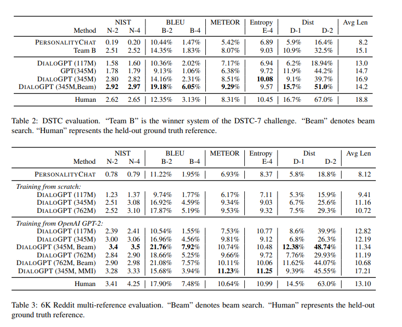
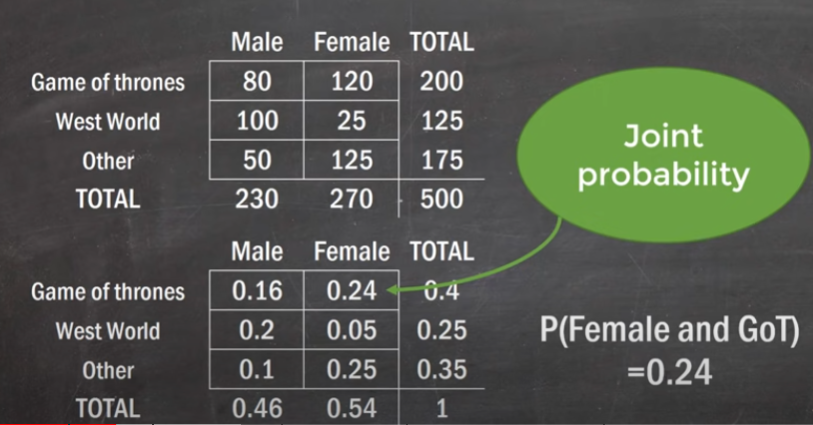

Link
===============

https://arxiv.org/pdf/1911.00536.pdf

Notes
===============

1. GPT2 have the capacity to capture textual data with fine granularity and produce output with a high-resolution that
   closely emulates real-world text written by humans.
2. Like GPT-2, DIALOGPT is formulated as an autoregressive (AR) language model, and uses the multi-layer transformer as
   model architecture. Unlike GPT-2, however, DIALOGPT is trained on large-scale dialogue pairs/sessions extracted from
   Reddit discussion chains.
3. The dataset is extracted from comment chains scraped from Reddit spanning from 2005 till 2017. Reddit discussions can
   be naturally expanded as tree-structured reply chains, since a thread replying to one thread forms the root node of
   subsequent threads. We extract each path from the root node to the leaf node as a training instance containing
   multiple turns of dialogue. We filter the data by removing the instances where (1) there is a URL in source or
   target, (2) where the target contains word repetitions of at least three words, (3) where the response does not
   contain at least one of the top-50 most frequent English words (e.g., “the”, “of”, “a”), since this probably
   indicates it might not be an English sentence, (4) where the response contains special markers such as “[” or “]”, as
   this could be markup language, (5) where source and target sequences together are longer than 200 words, (6) where
   the target contains offensive language, identified by phrase matching against a large blocklist. We also excluded a
   large number of subreddits that had been identified as likely to contain offensive content. In addition, we
   aggressively filtered out blandness, e.g., removing instances where the responses contained 90% of tri-grams that
   have been seen more than 1000 times. Often uninformative, such responses account for about 1% of the data. After
   filtering, the dataset comprises 147,116,725 dialogue instances, in total 1.8 billion words.
4. We trained our DIALOGPT model on the basis of the GPT-2 (Radford et al., 2018) architecture.The GPT-2 transformer
   model adopts the generic transformer language model (Vaswani et al., 2017)
   and leverages a stack of masked multi-head selfattention layers to train on massive web-text data.
5. Our model inherits from GPT-2 (Radford et al., 2018), a 12-to-48 layer transformer with layer normalization, a
   initialization scheme that accounts for model depth that we modified, and byte pair encodings (Sennrich et al., 2016)
   for the tokenizer.We follow the OpenAI GPT-2 to model a multiturn dialogue session as a long text and frame the
   generation task as language modeling. We first concatenate all dialog turns within a dialogue session into a long
   text x1, · · · , xN (N is the sequence length), ended by the end-of-text token. We denote the source sentence (
   dialogue history)as S = x1, · · · , xm and target sentence (ground truth response) as T = xm+1, · · · , xN , the
   conditional probability of P(T|S) can be written as the product of a series of conditional probabilities:
    For a multi-turn dialogue session T1, · · · , TK, (1)
   can be written as p(TK, · · · , T2|T1), which is essentially the product of conditional probabilities of p(Ti |T1, ·
   · · , Ti−1). Consequently, optimizing a single objective p(TK, · · · , T2|T1) can be perceived as optimizing all p(Ti
   |T1, · · · , Ti−1)
   source-target pairs.
6. Maximum mutual information scoring function
    1. MMI employs a pre-trained backward model to predict source sentences from given responses, i.e., P(Source|target)
       . We first generate a set of hypotheses using top-K sampling. Then we use the probability of P(Source|Hypothesis)
       to rerank all hypotheses. Intuitively, maximizing backward model likelihood penalizes the bland hypotheses, as
       frequent and repetitive hypotheses can be associated with many possible queries, thus yielding a lower
       probability for any specific query.
7. Our model uses a vocabulary of 50,257 entries, and was trained on 16 Nvidia V100 machines with NVLink. We used the
   Noam learning rate scheduler with 16000 warm-up steps. The learning rate is selected based on validation loss. Each
   model is trained until there is no progress in validation loss. For small and medium models, we trained the models
   for up to 5 epochs. For the large model we trained for at most 3 epochs.
8. Speeding up training To accelerate the training process and accommodate GPU memory limitations, we first compress all
   training data into a lazy-loading database file, so that data is loaded only when needed (pre-fetching large chunks
   to reduce access frequency). We also leverage separate asynchronous data processes to scale the training. As a
   result, training time declines approximately linearly w.r.t. the number of GPUs. We further employed a dynamic
   batching strategy to group conversations of similar lengths into the same batch, thus increasing training throughput.
9. 
10. Human evaluations We evaluated 2000 randomly sampled test sources from the Reddit 6K test dataset using
    crowd-sourcing. Systems were paired and each pair of system outputs was randomly presented to 3 judges, who ranked
    them for relevance, informativeness and how humanlike the generating is using a 3-point Likert-like scale.

Thoughts with Additional Information
===============

1. DIALOGPT is trained on 147M conversation-like exchanges from reddit?
    1. why not directly train on conversational dialogue?
2. What kind of information or abilities does language models have?
    1. Does language model understand words relationships or sentence relationships? For example, if I have context
       about Harry Potter, does the language models generate sentences related to harry potter in both the language
       style and the related context relationship? Or it can only generate a making sense sentences.
3. joint event in probability depends on two variables. Joint probability represent the probability that both of the
   variables appear, what is the probability of it while all the other possibilities sum up to 1.
   
   joint probability distribution means all the possibilities that includes certain two variables that sum up equal to 1
   
4. marginal probability (simple probability)
   
   
   
5. all probability distribution sum up to 1
6. probability distribution tells the probability of certain variables in the whole environment.
7. 
    flip two coins, fliping coins are independent events, the probability of getting both coins
   head is 0.5 x 0.5 which is 0.25, the reason why we can do it is because they are independent to each other.
8. papers always say they release the source code at the end of the introduction. Why?
    1. People will be interested in open sourced paper
    2. people will get interested in papers more after they get interested in the concept
9. How do I know if the parameters of a model is large enough for the training purpose.
10. if the DIALOGPT is trained on dataset with context, why it is only able to answer questions with single turn.

Summary
===============
In general, DialoGPT is a conversational model finetuned on language model GPT2. Thanks to the architecture of GPT2, the
autoregressive property of language model GPT2, the DialoGPT is able to generate response based on the given context. Compared
with GPT2's language generation ability, DialoGPT is more likely to generate conversational style languages. 
One of the key difference of DialoGPT is the using of MMI to penalize the usage of blend and generic response. I am not
100% understand the process of making MMI backword model, however, from the result table, the MMI reranking doesn't seem 
improve the performance of model compared with beam search. 
