Link
===============

https://arxiv.org/pdf/2111.02643.pdf

Notes
===============

1. One limitation of PLM-based dialogue modeling, and even for other PLM tasks, is the trade-off between pre-training
   and fine-tuning (Ben-David, Oved, and Reichart, 2021). That is, the task-specific data used for fine-tuning is
   usually scarce and costly. As such, the reusability of prior knowledge learned in the pre-training phase can be
   limited during fine-tuning, hence some dialogue models are simply trained from scratch on the limited task specific
   data.
2. Prompt learning keeps the PLM parameters frozen but optimizes only a small portion of task-specific prompts or
   related modules
3. DialogPrompt prepends a sequence of prompt tokens to each dialogue context for eliciting response from large
   pre-trained language models. In order to construct context-aware prompts, we propose a dynamic prompt encoder on top
   of the Transformer The prompt tokens are initially encoded conditionally on the dialogue context. The resulting
   prompt encoding is then taken as the initial hidden state of the large PLM to generate responses.
4. Paper contribution:
    1. To the best of our knowledge, we are the first to propose prompt-based learning for general dialogue generation.
       Our approach can better reuse knowledge from existing large-scale PLMs and produce more knowledgeable responses.
    2. We design a novel dynamic prompt encoder for encouraging context-aware prompt learning.
    3. We extensively evaluated our approach on popular multi-turn conversation datasets and demonstrated the
       superiority of our approach in terms of quantitative automatic evaluations and qualitative human evaluations.
5. Approach / Method
    1. Response Generation via Autoregressive Transformer Models
        1. In detail, let e(D) = [e(x1), . . . , e(xN )] be the embeddings of the dialogue tokens. These input
           embeddings are then fed into the pre-trained Transformer to obtain the contextual representations H
           = [h1, . . . , hN ], where each hi is a function of xi and the past representations of its left context:
           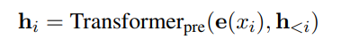
           Then, each hi is used to compute the distribution for the next token: p(xi+1|h≤i) = softmax(Whi)
           and W is a pre-trained matrix that maps hi to logits over the vocabulary.
    2. Prompt Learning for Conversations
        1. One intuitive baseline approach can be proposed to simply adopt previous work in prompt learning
           (e.g., prefix-tuning on GPT-2 (Li and Liang, 2021)) for conversations. More specifically, we can prepend a
           prompt utterance of k tokens P = [p1, . . . , pk] to each dialogue context to obtain D˜ = [P; C; R], as shown
           in Figure 1 (middle). A fully connected prompt encoder can be designed to transform the prompt utterance into
           a sequence of hidden states, namely.
           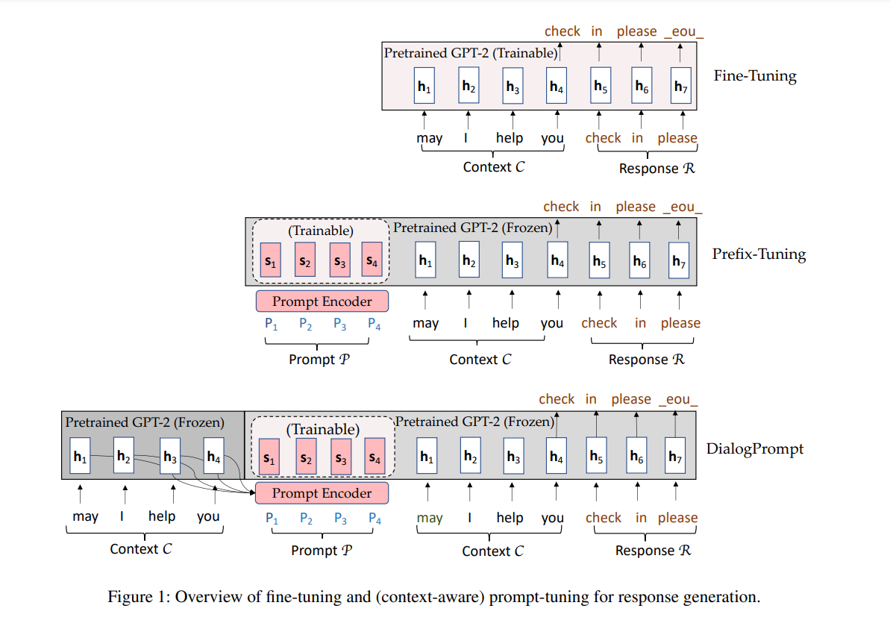
           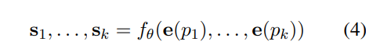
           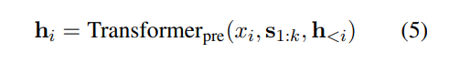
        2. The training objective is to only optimize the prompt parameters θ while keeping the pre-trained Transformer
           parameters φ frozen, namely,
           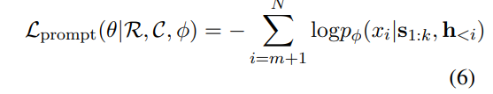
    3. Dynamic Prompt Learning for Context-Aware Prompt Adaptation
        1. In the previous model, the encoding of the prompt utterance s1, . . . , sk is independent of dialog context
           C. That means, prompts for all conversations share the same encoding. However, the latent space of dialogue
           context is more complicated and difficult to be represented with such a unified encoding. Intuitively, the
           context can influence the encoding of prompt by guiding what to extract from the PLM
        2. Given the dialogue context C=[x1, . . . , xm] with a prompt utterance P=[p1, . . . , pk], the prompt
           encodings [˜s1, . . . , ˜sk] are dynamically generated conditioning on the context using another
           autoregressive Transformer:
           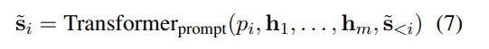
           where h1, ..., hm are computed using Equation 2 and are taken as past hidden states for the new Transformer
           to generate the prompt encodings. Now we update the hidden states of the pretrained Transformer based on the
           new prompt encodings:
           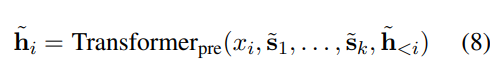
           The final hidden states [˜s1, . . . , s˜k, h˜ 1, . . . , h˜ i]
           are taken as input the the pre-trained language model to generate the response. Our training objective now
           becomes to minimize the following loss function:
           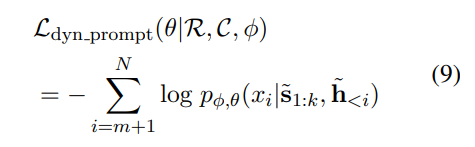
6. experimental setup
    1. DailyDialog A manually labeled multi-turn dialogue dataset that contains daily conversations in English.
       DailyDialog has a more chitchat style compared to other datasets.
    2. MultiWOZ is a fully-labeled collection of human-human written conversations spanning over multiple domains and
       topics such as attraction, hotel, hospital, police, restaurant, train, and taxi.
7. Implementation Details
    1. We used GPT-2 (Radford et al., 2019) as the backbone PLM for all models. GPT-2 has been widely employed for
       generating dialogues (Zhang et al., 2019). We did not take the more advanced GPT3 due to the restriction of our
       computational resources. Besides, GPT-3 relies heavily on super large models and training corpora, so the effect
       of prompt learning could be overwhelmed. Our implementation was based on the Huggingface Transformer repository (
       Wolf et al., 2019). For the sake of computational efficiency, we limit each context to have at most 4 utterances,
       with each containing less than 20 words. The batch size for all models was set to 32. In the generation phase, we
       used the top-1 sampling for response decoding. The hyperparameters we tuned include the prompt size and learning
       rate.
    2. We trained all models on a Linux server with Ubuntu 16.04 and a GPU of Nvidia Tesla V100. The training processes
       were early stopped when there was no progress on the validation loss. Then, the corresponding checkpoint is used
       to evaluate the performance on the test set. We run each experiment for five times and reported the average
       scores.
8. Evaluation Metrics
    1. We evaluate all models using five commonly used metrics in NLG, namely, BLEU (Papineni et al., 2002), NIST (
       Doddington, 2002), METEOR (Lavie and Agarwal, 2007), ROUGE-L (Lin, 2004), and the average length of generated
       responses.
        1. BLEU evaluates how many n-grams in the generated response match those in the human reference
        2. NIST (Doddington, 2002) is similar to BLEU but assigns different weights to n-gram matches according to their
           information gain.
        3. METEOR (Lavie and Agarwal, 2007) is based on unigram matching (surface forms, stemmed forms, and meanings)
           between the generated response and human reference.
        4. ROUGEL (Lin, 2004) measures the longest common subsequence (LCS) between the generated response and human
           reference.
        5. Finally, the average length of generated responses is also a critical metric to measure the quality of
           generated responses.
9. Evaluation Results
    1. 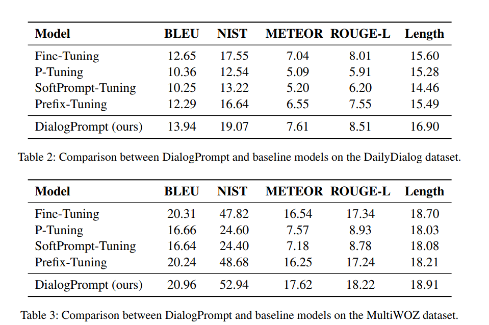
       the BLEU score is increased by 10% on the DailyDialog dataset. Such improvement is consistent on both datasets,
       affirming the superiority of the prompt based pre-trained dialogue model. This indicates that our approach by
       eliciting knowledge from pre-trained GPT-2 is more effective than the fine-tuning counterparts.
    2. Among the three prompt learning models (i.e., ptuning, softprompt-tuning, and prefix-tuning), the prefix-tuning
       achieves the best performance on both datasets. This is probably because the prefixtuning optimizes activations
       of all layers, which is more compatible to autoregressive Transformers such as GPT-2. Besides, the prefix-tuning
       optimizes more parameters compared to simply optimizing prompt embeddings (Li and Liang, 2021; Liu et al., 2021b)
       . The improvement of DialogPrompt on the MultiWOZ dataset is less significant in terms of BLEU and average
       response length compared to that on the DailyDialog dataset. This is probably because the MultiWOZ dataset was
       originally prepared for task-oriented dialogues and contains specific domain knowledge. Such task-specific
       knowledge might not contained in the pre-trained GPT-2. Another possible reason for this phenomenon is that
       MultiWOZ has a larger amount of data, which brings more efficacy for fine-tuning methods which are usually data
       hungry. Overall, these results show that DialogPrompt can utilize pre-trained language models more effectively
       than general prompt learning methods.
    3. human evaluation
        1. We randomly sampled 200 dialogues from the test set of DailyDialog. For each of the samples, we present the
           dialogue context, followed by a pair of responses from our model or a baseline model (without order), to
           three different workers. Each worker was asked to evaluate the responses in terms of the three criteria,
           namely, coherence, informativeness, and fluency. Coherence measures how relevant the generated responses are
           to the context. Informativeness measures how well the generated response includes non-trivial information.
           Fluency measures how well the generated responses are human readable. Finally, the workers blindly rated
           their preference using a 3-point Likert scale: “win” (ours is better), “loss” (the other is better) and
           “tie” (equally good or bad).
           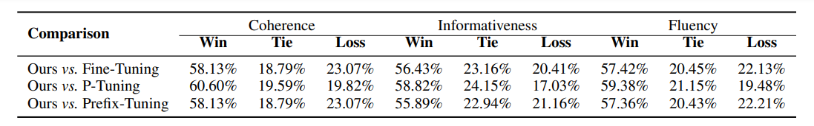

Thoughts with Additional Information
===============

1. conditional probability
   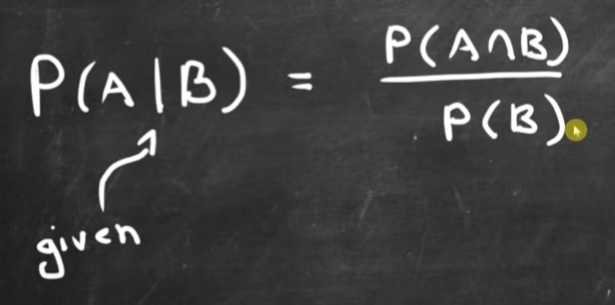
   given B occur, what is the probability of A? It is in all spaces that B has, the probability that A occer as well. If
   there are 30 in B space, 1 that A and B occer at the same time, that the probability of A given B is 1/30, thus we
   have the above image.
   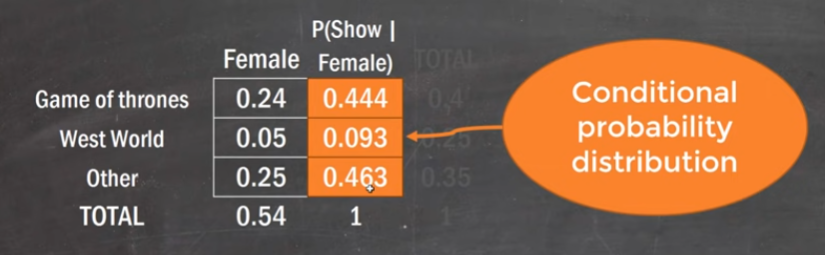
2. How to choose appropriate dataset for testing or training?
3. How to setup the hyperparameters for different dataset? Is it making a lot of difference by using better
   hyperparameters?
4. Prefix-Tuning, optimizes hidden states of all Transformers layers for the prompt tokens??????
5. Language should be a tool to use instead of the language generator itself. How to use it maybe is the key to further
   improve the NLP, chatbot performance. Human can fake like they don't speak well language by purpose, but it is harder
   than speaking well language if they are native speaker. Is finetune or prompt tuning more human like? Why different
   people have different speaking style? What exactly is the speaking style?
    1. I think speaking style is not that different. The more important thing is what kind of questions the speaker ask?
       what kind of answer the speaker respond? And the most important thing is the stories or experience the speaker
       have.
6. If the reason why finetune is not optimized is that it needs to train whole parameters, then what is the best
   tradeoff or the least amount of parameters needs to be retrained to maintain the STOA performance on certain task?
   only re-training on certain amount of parameters or prompt-tuning, which is better and why?
7. Seems like human could do a lot of different tasks as a single person, but model cannot. Is it because the technology
   is not advanced enough or it is just simply impossible? As the larger the PLM size is, the less improvement is the
   DialogPrompt than the finetune. In other word, if the model size getting larger and larger, the task become more and
   more complex, finetune method seems like have higher and higher performance. Until the prompt tuning method cannot
   match up with finetune on extreme complex task, so there will be a trade-off between multimodal and model performance
   on certain tasks.
8. seems like blenderbot is able to use its context and persona sometimes, but how exactly I should utilize the persona
   and context? Is it something prompt-tuning can help with?

Summary
===============
Author is trying to find a new method to generate response given a dialogue context. By stating the question of
finetune, P-tuning and soft tokens (Prefix) problems, separately, author provides a new prompt-tuning method, called
dynamic prompt learning for context-aware prompt adaptation. The new method uses context to further improve the
performance of prompt-tuning method. The automatic test and human evaluation show that the new method surpass SOTA
method (Finetune)
The question of finetune is the needing to re-train a huge language model with billions of parameters. This is too 
much computational cost and time-consuming. P-tuning is to manually add prompt to let the language model generate
the rest of the sentence