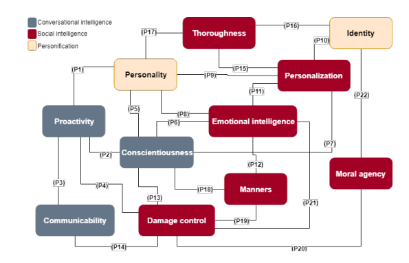

Link    
===============

https://arxiv.org/pdf/1904.02743.pdf

Notes
===============
1. Conversational intelligence
   1. Proactivity is the capability of a system to autonomously act on the user’s behalf 
   and thereby reduce the amount of human effort to complete a task. 
      1. proactivity in chatbots adds value to interactions
      2. proactively suggesting and encouraging new topics have been
         shown useful to both inspire users and keep the conversation alive
      3. proactivity can be annoying when the chatbot conveys the impression of 
         trying to control the user
   2. Conscientiousness is a chatbot’s capacity to demonstrate attentiveness 
   to the conversation at hand. 
      1. to provide meaningful answers
      2. to hold a continuous conversation
      3. to harden the conversation: aiming to ensure the conversational structure–
         and to hide natural language limitations–chatbots are designed to restrict free-text
         inputs from the user. Thus, the challenge lies in how to leverage the 
         benefits of suggesting predefined inputs without limiting conversational capabilities
      4. visual elements: user-interface resources–such as quick replies, cards, and
         carousels–are used to structure the conversation and reduce issues regarding understanding
      5. context window: to keep the user aware of the chatbot’s current context, developed a chatbot
         for shopping that shows a context window on the side of the conversation.
   3. communicability is defined as the capacity of a software to convey to users its 
   underlying design intent and interactive principles
      6. to unveil functionalities:
      7. 22% of the participants explicitly asked the chatbot about its capabilities 
         (e.g., “what can you do?”), and 1.8% of all the users’ messages were ability check questions. 
      8. when first-time users do not understand chatbots’ capabilities and limitations, they
         have high expectations and, consequently, end up more frustrated when the chatbots fail.
2. Social Intelligence
   1. Damage control is the ability of a chatbot to deal with either conflict or failure situations.
      Chatbots should be able to respond to social cues during the conversation,
      accept differences, and manage conflicts
      1. When talking to a chatbot, humans are more likely to harass test the agent’s capabilities
         and knowledge and feel disappointed with mistakes.
      2. it is necessary to enrich chatbots with the ability to recover from failures and
         handle inappropriate talk in a socially acceptable manner
      3. to appropriately respond to harassment
   2. to deal with lack of knowledge: chatbots often fail in a conversation due to 
      lack of either linguistic or world knowledge
   3. to predict users’ satisfaction: chatbots should perceive both explicit and
      implicit feedback about users’ (dis)satisfaction.
   4. Thoroughness is the ability of a chatbot to be precise regarding how it uses language.
      1. adapting the language to the interlocutor is a common behavior for humans.
   5. Manners refer to the ability of a chatbot to manifest polite behavior and conversational
      habits
   6. Emotional intelligence is a subset of social intelligence that allows an individual to
      appraise and express feelings, regulate affective reactions, and harness emotions to
      solve a problem. 
      1. the perception that the chatbot understands one’s feelings may create a sense of belonging and acceptance.
      2. longer conversations (10+ turns) are needed to fulfill the needs of affection and belonging. Therefore,
         the authors defined conversation-turns per session as a success metric for chatbots,
         where usefulness and emotional understanding are combined.
      3. adapting chatbots’ language to their current emotional state, along with their personality and social role
         awareness, results in more believable interactions.
      4. hypothesized that a high level of self-disclosure and reciprocity in communication with chatbots would
         increase trust, intimacy, and enjoyment, ultimately improving user satisfaction and intention to use.
      5. personalization is used to customize the interface toward user familiarity.
3. Personification
   1. Although research on personification is more common in the Embodied Conversational Agents field, 
      chatbot embodiment can be created through narrative without any visual help.
   2. Identity refers to the ability of an individual to demonstrate belonging to a particular
      social group.
      1. Aspects that convey the chatbots’ identity include gender, age, language style, and name.
      2. identity helps manifest credibility and trust.
   3. Personality refers to personal traits that help to predict someone’s thoughts, feelings,
      and behaviors.
      1. chatbots personality can make the interaction more enjoyable.
      

Thoughts
===============
1. Different personality might have different level of proactivity. 
2. we need to either maximum embody the IP's personality or create our own IP. It is 
   the ip character with strong personality attract people instead of how chatbot could 
   talk in ways that make people comfortable.
3. right now our chatbot only focused on Conscientiousness.
4. definitely need to have a system to keep track with user-chatbot relationship.

Summary   
===============