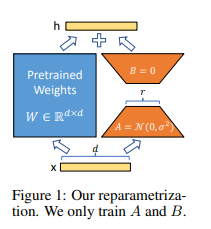

Link    
===============

https://arxiv.org/pdf/2106.09685.pdf

Notes
===============
1. Low-Rank Adaptation, or LoRA:
   1. freezes the pretrained model weights and injects trainable rank decomposition matrices into
      each layer of the Transformer architecture, greatly reducing the number of trainable 
      parameters for downstream tasks. 
   2. Compared to GPT-3 175B fine-tuned with Adam, LoRA can reduce the number of trainable
      parameters by 10,000 times.
      
2. LoRA possesses several key advantages.
   1. A pre-trained model can be shared and used to build many small LoRA modules for different tasks.
      We can freeze the shared model and efficiently switch tasks by replacing the matrices A and B 
      in Figure 1, reducing the storage requirement and task-switching overhead significantly. 
   2. LoRA makes training more efficient and lowers the hardware barrier to entry by up to 3 
      times when using adaptive optimizers since we do not need to calculate the gradients or 
      maintain the optimizer states for most parameters. Instead, we only optimize the injected, 
      much smaller low-rank matrices. 
   3. Our simple linear design allows us to merge the trainable matrices with the frozen weights 
      when deployed, introducing no inference latency compared to a fully fine-tuned model, by construction. 
   4. LoRA is orthogonal to many prior methods and can be combined with many of them, such 
      as prefix-tuning. 

Thoughts
===============
1. human brain has fixed neurons, however, we can still be adapted to a lot of different jobs, why?
   1. fine-tuning changed all the parameters is making the whole network fitting only one or certain
      tasks. How large is too large for a neural network to perform a task well? are there some 
      basic parameters that could be used for a lot of tasks? For example, human has the ability to
      write, they can write a lot of different things or use language in a lot of different places.
      The stronger people can write or organize their languages, they easier they can apply their
      writing skills to a lot of different areas. 

Summary   
===============