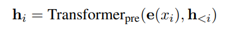
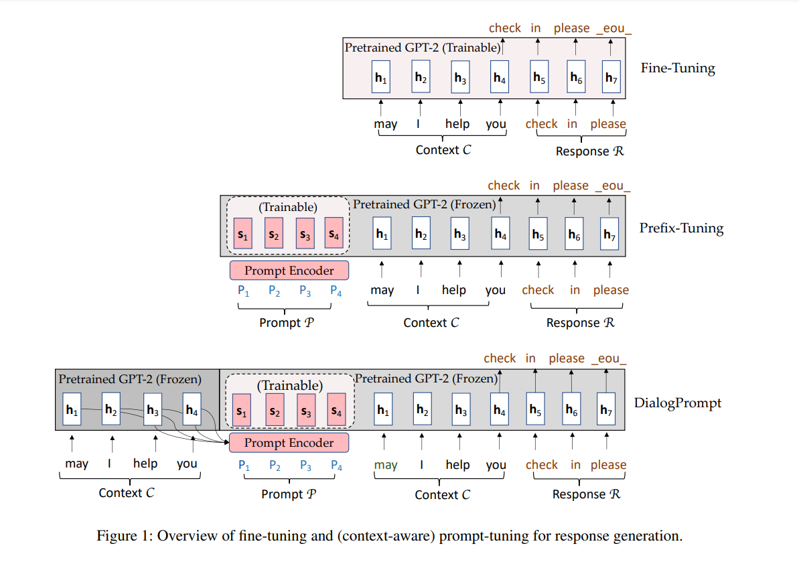
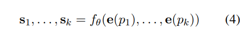
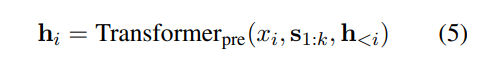
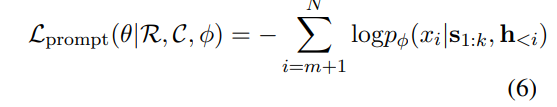
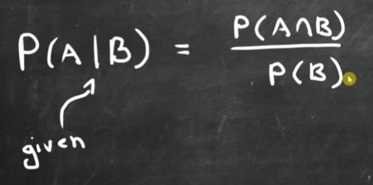

Link    
===============

https://arxiv.org/pdf/2111.02643.pdf

Notes
===============
1. One limitation of PLM-based dialogue modeling, and even for other PLM tasks, is the trade-off 
   between pre-training and fine-tuning (Ben-David, Oved, and Reichart, 2021). That is, the task-specific
   data used for fine-tuning is usually scarce and costly. As such, the reusability of prior knowledge
   learned in the pre-training phase can be limited during fine-tuning, hence some dialogue models
   are simply trained from scratch on the limited task specific data.
2. Prompt learning keeps the PLM parameters frozen but optimizes only a small portion of 
   task-specific prompts or related modules
3. DialogPrompt prepends a sequence of prompt tokens to each dialogue context for eliciting response from
   large pre-trained language models. In order to construct context-aware prompts, we propose a dynamic
   prompt encoder on top of the Transformer The prompt tokens are initially encoded conditionally on the 
   dialogue context. The resulting prompt encoding is then taken as the initial hidden state of the large PLM 
   to generate responses.
4. Paper contribution:
   1. To the best of our knowledge, we are the first to propose prompt-based learning for general 
      dialogue generation. Our approach can better reuse knowledge from existing large-scale 
      PLMs and produce more knowledgeable responses. 
   2. We design a novel dynamic prompt encoder for encouraging context-aware prompt learning. 
   3. We extensively evaluated our approach on popular multi-turn conversation datasets and 
      demonstrated the superiority of our approach in terms of quantitative automatic evaluations 
      and qualitative human evaluations.
5. Approach / Method
   1. Response Generation via Autoregressive Transformer Models
      1. In detail, let e(D) = [e(x1), . . . , e(xN )] be the embeddings of the dialogue tokens. These input
         embeddings are then fed into the pre-trained Transformer to obtain the contextual representations H 
         = [h1, . . . , hN ], where each hi is a function of xi and the past representations of its left context:
         
         Then, each hi is used to compute the distribution for the next token: p(xi+1|h≤i) = softmax(Whi)
         and W is a pre-trained matrix that maps hi to logits over the vocabulary.
   2. Prompt Learning for Conversations
      1. One intuitive baseline approach can be proposed to simply adopt previous work in prompt learning 
         (e.g., prefix-tuning on GPT-2 (Li and Liang, 2021)) for conversations. More specifically, we 
         can prepend a prompt utterance of k tokens P = [p1, . . . , pk] to each dialogue context to obtain D˜ 
         = [P; C; R], as shown in Figure 1 (middle). A fully connected prompt encoder can be designed to 
         transform the prompt utterance into a sequence of hidden states, namely.
         
         
         
      2. The training objective is to only optimize the prompt parameters θ while keeping the pre-trained
         Transformer parameters φ frozen, namely,
         
   3. Dynamic Prompt Learning for Context-Aware Prompt Adaptation
      1. 

Thoughts
===============
1. conditional probability 
   
   given B occur, what is the probability of A? It is in all spaces that B has, the probability that A occer
   as well. If there are 30 in B space, 1 that A and B occer at the same time, that the probability
   of A given B is 1/30, thus we have the above image. 

Summary   
===============