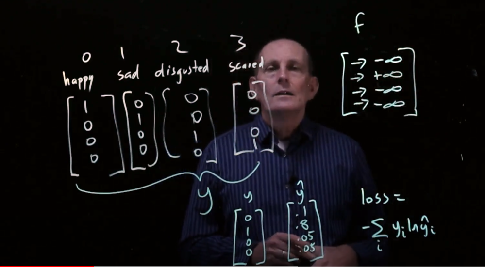

Link
===============

https://aclanthology.org/2021.emnlp-main.183.pdf

Notes
===============

1. Generally, grounded dialogue modeling trains a dialogue model on a dataset D that consists of triples (c, r, g),
   where c is the dialogue history, r is the response, and g is the grounded concept. The model is generally optimized
   using maximum likelihood estimate (MLE)
   
   Despite its effectiveness, this formulation faces two challenges regarding transferability.
    1. grounded dialogue datasets are usually collected under a guided setting, e.g., annotators are usually encouraged
       to embed personaor knowledge into responses (create an embedding to represent users' persona), which leads to a
       distributional gap between the conversations in a grounded dialogue dataset and natural conversations. As a
       result, models trained with Eq. (1) may generate unnatural responses and are vulnerable to the distributional
       shift of the dialogue history.
    2. at inference time, models trained with Eq. (1) cannot be grounded on unseen types of concept g 0 other than g. An
       example for such grounding gap is that a model trained on PERSONACHAT (Zhang et al., 2018) with Eq. (1)
       cannot be grounded on world knowledge.
    3. To address the above transferability challenges, we propose a grounded minimal editing framework for grounded
       dialogue modeling. Instead of learning a grounded response generator as is done in Eq. (1), we propose to learn a
       grounded minimal editor that operates on existing responses. Specifically, suppose we have an original response r
       o that is coherent with the dialogue history c but is not grounded on the concept g. Our goal is to minimally
       edit r o such that it is grounded on the concept g and coherent with the dialogue history c.
    4. Note that collecting paired responses before and after editing is resource-consuming; thus, our goal is to learn
       the editing without paired data.
    5. 
2. Main contributions
    1. We propose a framework named grounded minimal editing to address the transferability challenges of grounded
       dialogue modeling.
    2. We propose Grounded Minimal Editor (GME)
       and present the PERSONAMINEDIT dataset to evaluate GME’s effectiveness for personagrounded minimal editing.
    3. Experimental results show that GME largely outperforms strong baselines on the PERSONAMINEDIT dataset. GME is
       also transferable to edit other models’ outputs and improve the persona consistency while preserving their use of
       knowledge and empathy.
3. What stands out in this paper:
    1. try to solve the two main transferability challenges
    2. essentially different from existed idea of editing existing responses:
        1. Regarding the formulation, we emphasize minimal editing, while previous works do not. As analyzed in Section
           1, minimal editing is an important component to address the transferability challenges.
        2. Regarding the training algorithm, previous works derive templates from self-generated or retrieved texts,
           while our model derives templates from the observed responses.
4. Formulation
    1. 
    2. Grounded dialogue modeling uses a dataset D that consists of triples (c, r, g), where c, r, and g are the
       dialogue history, the response, and the grounded concept, which are shown in grey in the left part of Figure 2.
       To formulate the term “minimal”, we need to add unobserved variables into the graphical model, denoted as u in
       Figure 2, which cover all unobserved variables. The graph states that r = f(c, g, u). As shown in the right part
       of Figure 2, we observe (c, ro , ge) at inference time, where r o and g e stand for the original response and the
       grounded concept for editing. The graph states that the original response r o = f(c, go , u), where g o
       represents the concept the original response is grounded on, and that both g o and u are unobserved. The edited
       response is defined as r e = f(c, ge , u), which replaces g o as g e , and keeps c and u intact. Our formulation
       follows the idea of counterfactual reasoning (Peters et al., 2017), and it guarantees that 1) the content
       irrelevant to the grounded concept is preserved, and that 2) the edited response is coherent with the dialogue
       history. Since it is costly to collect paired (r o , re) for training, the grounded minimal editor should be
       trained on the grounded dialogue data (c, r, g) ∼ D as in Eq. (1). As the first attempt toward the proposed
       framework, we focus on persona-grounded minimal editing in the experiments. Thus, in the remaining part of this
       paper, we set the grounded concept g, g o , g e as the persona p, p o , p e.
5. Approach
    1. At inference, GME first creates a response template t by masking persona-related spans in the original response r
       o and then recombines the template t, the persona p e , and the dialogue history c into an edited response r e.
       
    2. Recombination Module
        1. The recombination module learns to recombine the response template, the persona, and the dialogue history as
           the edited response.
        2. Span mask
            1. The span mask serves as the placeholder of persona-related spans. For each response persona pair, we
               define three sets of tokens:
                1. GRADIENT contains persona-related tokens that are determined using gradient-based attribution. We
                   pretrain a response-to-persona model and compute the L2 norm of the gradient of the persona’s
                   cross-entropy loss w.r.t. each response token’s embeddings. A token is placed into the GRADIENT set
                   if the L2 norm is greater than δ = 3.
                2. OVERLAP contains response tokens whose lemma overlaps with in the lemmas of the persona tokens, which
                   are likely to be related to the persona.
                3. STOPWORDS contains stopwords and punctuation marks specified by NLTK.
            2. We mask a token if it is in GRADIENT or OVERLAP but not in STOPWORDS. We call sentences with masks after
               this step as persona-related sentences. For each persona-related sentence, we further mask 15% of its
               tokens to improve the robustness. Since the number of tokens varies at the same syntactic position, we
               merge consecutive masks so that all masks are at the span level.
        3. Sentence deletion
            1. The above span mask is effective for correcting persona contradictions in the original response. However,
               span mask cannot handle the situation where we want to add new persona information into the response. To
               model this pattern, we randomly delete persona-related sentences. Suppose we have l persona-related
               sentences in the response, the number to keep 0 ≤ n ≤ l−1 follows P(n) ∝ exp(−n/τ ), where τ is a
               hyperparameter. By infilling persona-related sentences, the model learns to merge persona into the
               response.
               
               An example of the training template is shown in Figure 3. During training, the recombinition modules Pθ
               is optimized by
               
               where T (t|r, p) denotes the distribution of the template as detailed above. As shown in Figure 3, we use
               GPT-2 as the backbone to parameterize Pθ, which is tackled as a language modeling task by concatenating
               input texts. We apply label smoothing ( = 0.1), and we use greedy decoding at inference. Token type
               embeddings are used to distinguish each type of text and each speaker.
        4. Mask Generator
            1. Since the persona of the original response before editing, i.e., p o , is unobserved at inference, we
               train a mask generator Pφ to predict if a token ri should be masked. The objective for the mask generator
               is.
               
               where mi = 1 if ri is in GRADIENT or OVERLAP but not in STOPWORDS, and mi = 0 otherwise. fi is the
               corpus-level frequency of mi , which is used to balance the number of positive samples and negative
               samples. At inference, we mask a word if1) Pφ labels it as masked with a confidence greater than  ( =
               0.5 in the main experiment,  = 0.75 in the transferability experiment) and meanwhile 2)
               it does not appear in the persona p e or the dialogue history c. We merge consecutive masks to get span
               masks. This process is denoted as T φ test(t|c, ro , pe) in Algorithm 1.

Thoughts with Additional Information
===============

1. the first question mentioned in the challenges regarding transferability also appeared in the RAG, sometimes the
   model tend to directly copy and paste the information from the documents. This paper names this issue distributional
   gap.
2. Are all the model problems caused by integrating? If we further divided a model's task to several subtasks, seems
   like the model could perform better.
3. We all know the data is the key for any DL model. What would I do if there is no data available? What is the key idea
   for solving problem that does not have enough data supporting. (no parallel data)
4. why minimal editing is an important component to address the transferability challenges?
5. what is the template in the paper? Response template? derives templates from the observed responses?
    1. template is the masked original response for future editing.
    2. observed response is the original response given the dialogue history.
6. why there is grounding gap? What does it mean cannot be grounded on unseen types? What exactly is unseen mean here?
   completely unseen, or partially unseen?
7. why the distributional gap happen? How unnatural responses could be?
8. what is gradient-based attribution? why author compute the L2 norm of the gradient of the persona’s cross-entropy
   loss?
9. L1 & L2 Norm (a way to measure magnitude of vectors)
    1. 
    2. 
    3. L1 norm always exceed the L2 norm if they have the same vector
    4. 
10. label smoothing
    1. 
    2. label smoothing try to mitigate this extreme situation, try not to be dogmatic.
    3.  once the value reach the boundary, we are good and stop there.
    4. There are two ways to do label smoothing:
        1. change it in the labels
        2. change it in the loss function

Summary
================