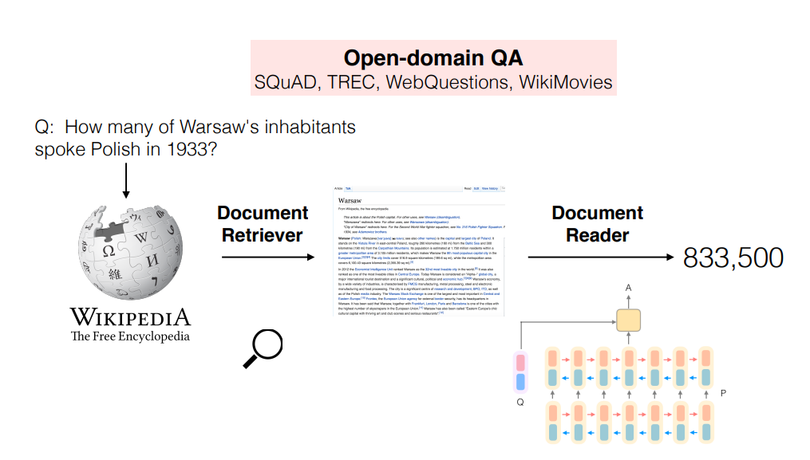

Link    
===============

https://arxiv.org/pdf/1704.00051.pdf

Notes
===============
1. In order to answer any question, one must first retrieve the few relevant articles among more
   than 5 million items, and then scan them carefully to identify the answer. We term this setting,
   machine reading at scale (MRS). Our work treats Wikipedia as a collection of articles and does not
   rely on its internal graph structure. As a result, our approach is generic and could be switched to other
   collections of documents, books, or even daily updated newspapers.
2. Large-scale QA systems like IBM’s DeepQA rely on multiple sources to answer: besides Wikipedia, it is also paired
   with KBs, dictionaries, and even news articles, books, etc. As a result, such systems heavily rely
   on information redundancy among the sources to answer correctly.
3. We develop DrQA, a strong system for question answering from Wikipedia
   composed of: (1) Document Retriever, a module using bigram hashing and TF-IDF matching
   designed to, given a question, efficiently return a subset of relevant articles and (2) Document
   Reader, a multi-layer recurrent neural network machine comprehension model trained to detect
   answer spans in those few returned documents.
   

Thoughts
===============

Summary
===============