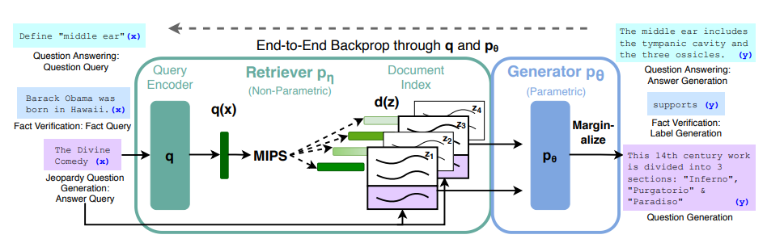

Link    
===============

https://arxiv.org/pdf/2005.11401.pdf

Notes
===============

1. We endow pre-trained, parametric-memory generation models with a non-parametric memory through
   a general-purpose fine-tuning approach which we refer to as retrieval-augmented generation (RAG).
   We build RAG models where the parametric memory is a pre-trained seq2seq transformer, and the
   non-parametric memory is a dense vector index of Wikipedia, accessed with a pre-trained neural
   retriever. We combine these components in a probabilistic model trained end-to-end. The
   retriever (Dense Passage Retriever, henceforth DPR) provides latent documents conditioned on
   the input, and the seq2seq model (BART) then conditions on these latent documents together with
   the input to generate the output. 
2. In one approach, RAG-Sequence, the model uses the same document to predict each target token. 
   The second approach, RAG-Token, can predict each target token based on a different document.
3. 

Thoughts
===============

Summary   
===============