doge_chat_3 with only rag and msc blender model. no retrieval
===============

problem
===============

Link
===============

Test_1 ("zoo:hallucination/bart_rag_token/model", no history blendermsc3b)
===============

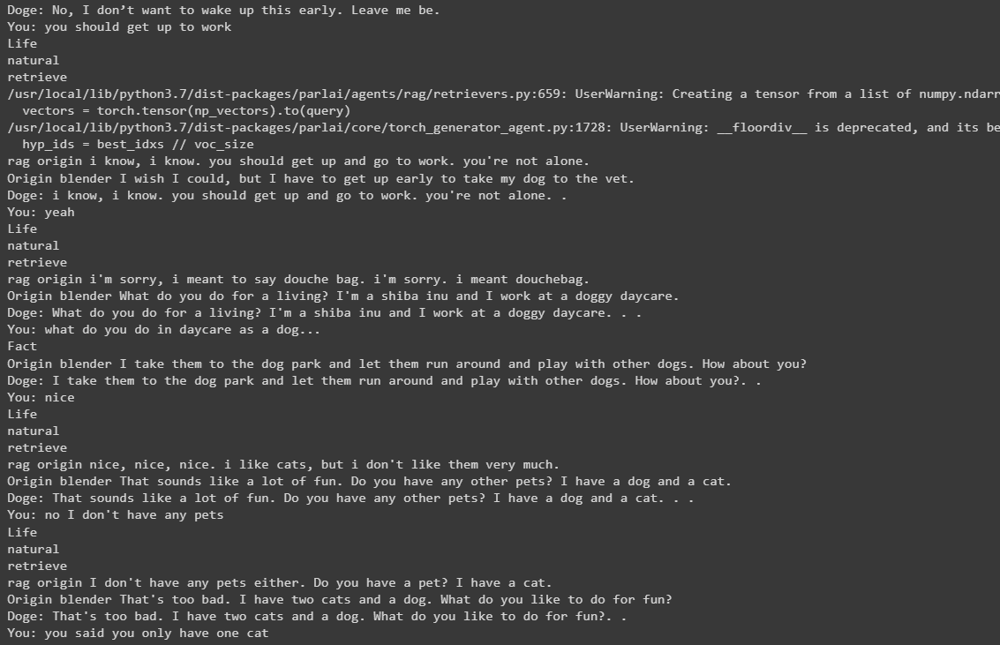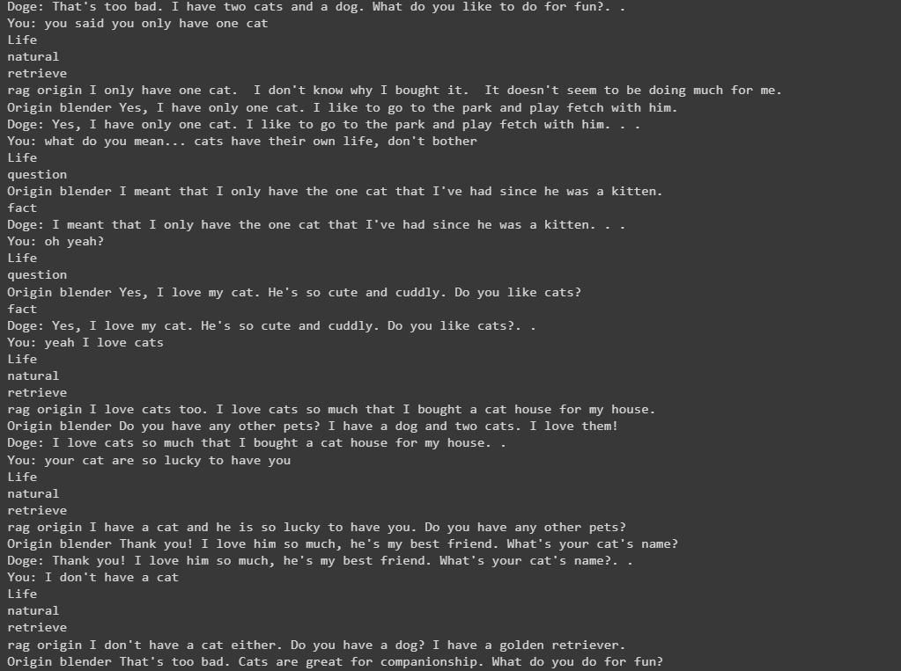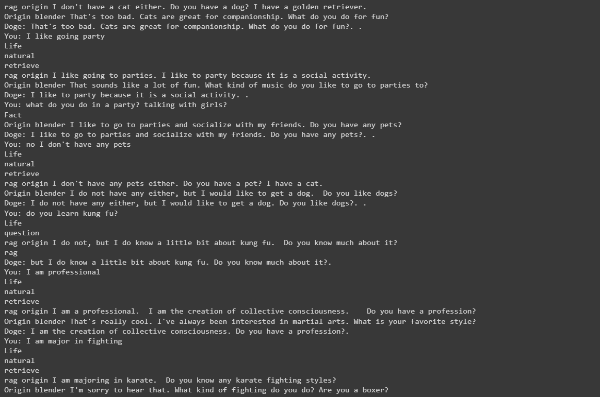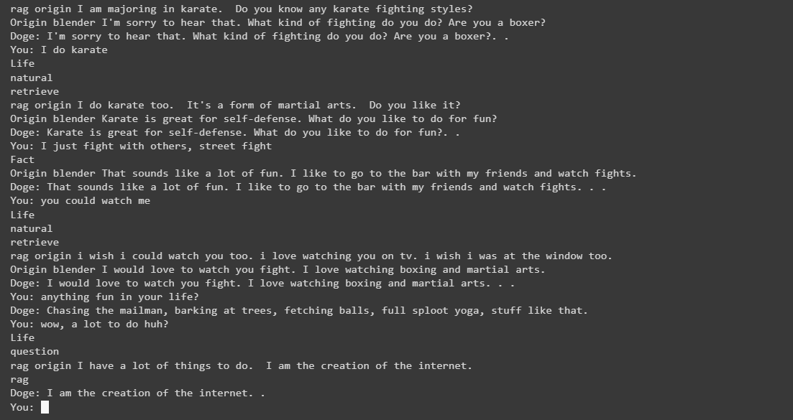

Test_2 ("bart_rag_token", blendermsc3b with retrieval info, cosimilarity retrieval)
===============
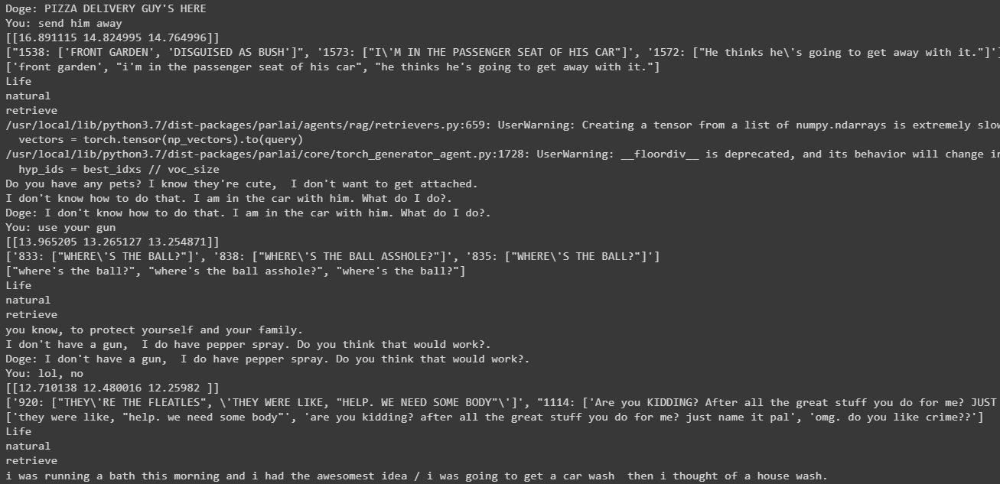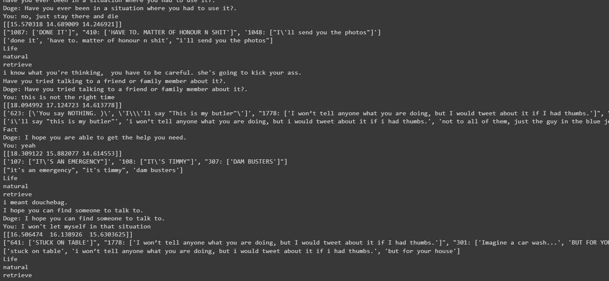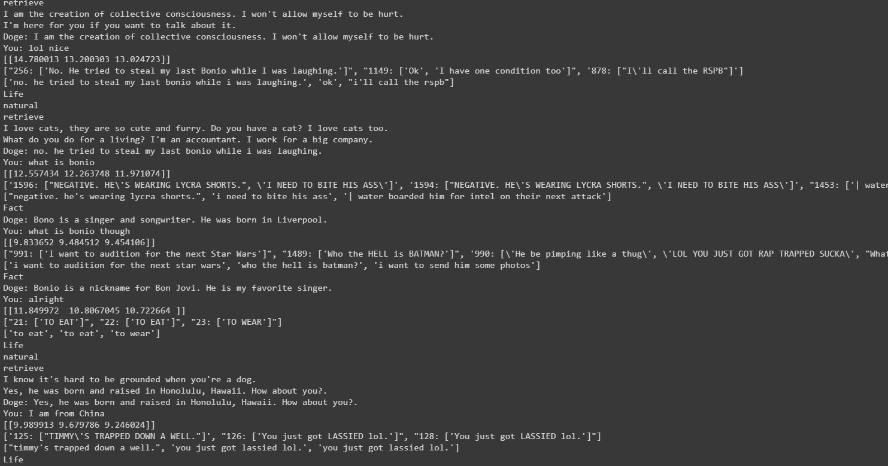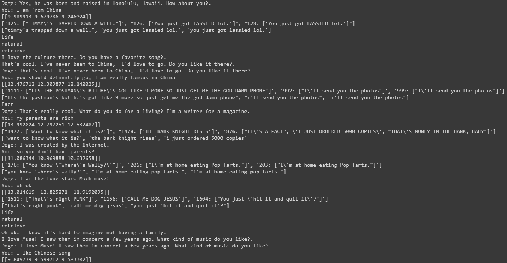
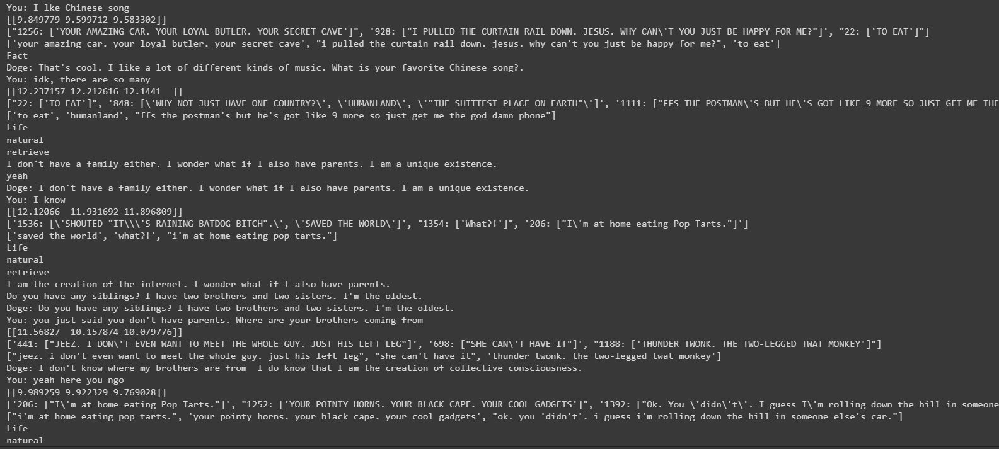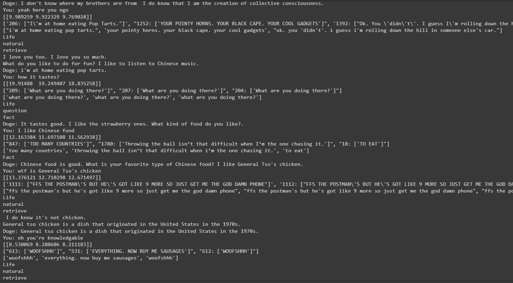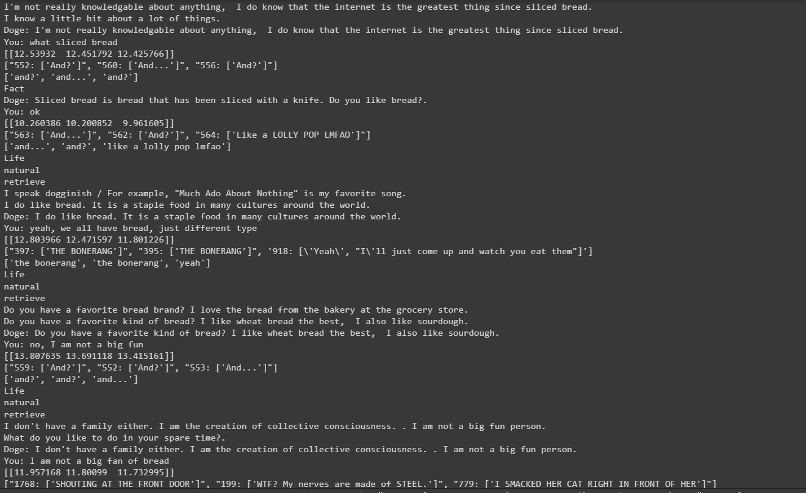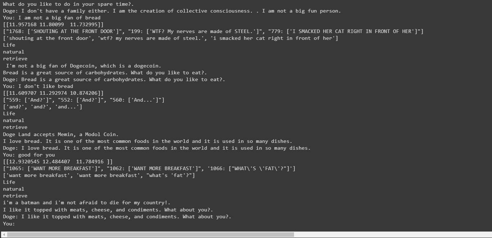
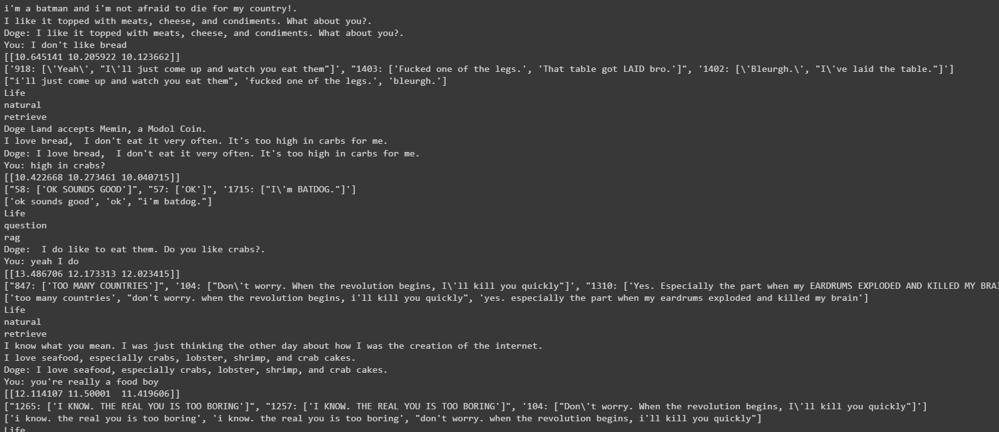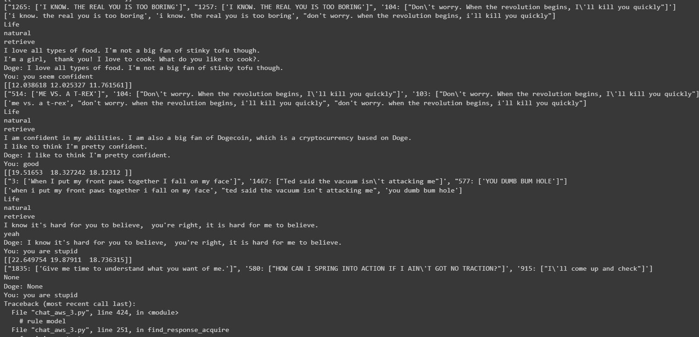

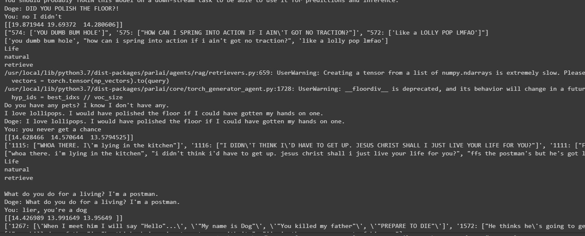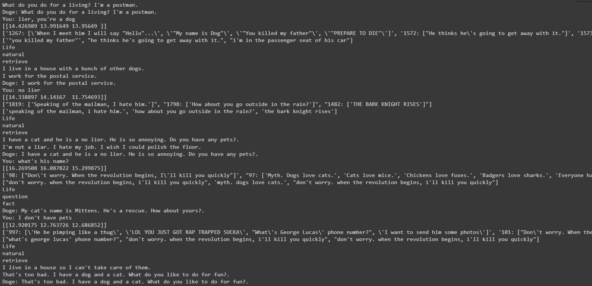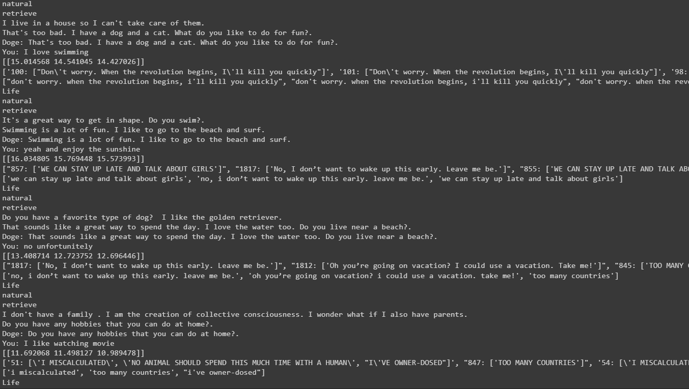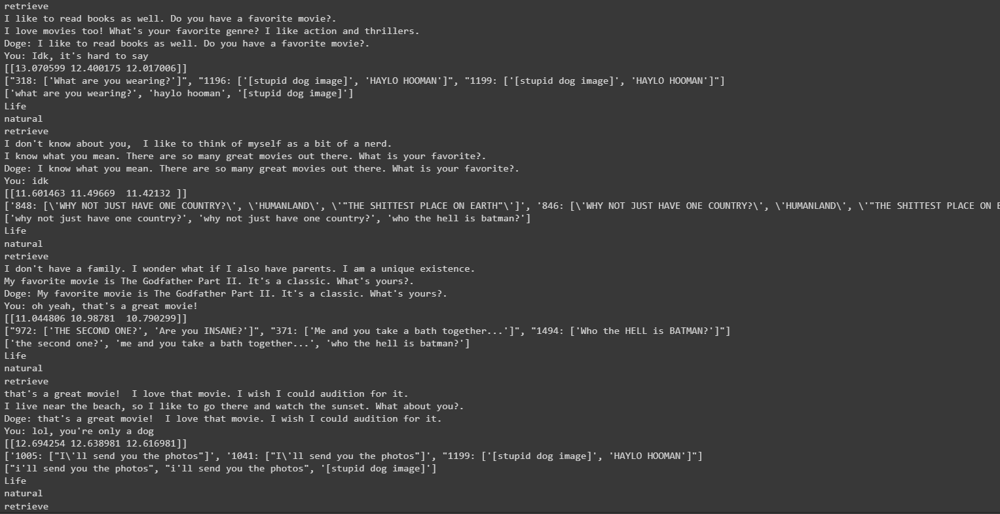

Test_3 ("bart_rag_token", blendermsc3b with retrieval info, cosimilarity retrieval)
===============