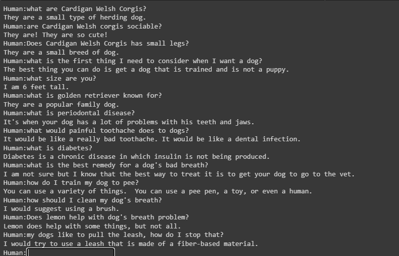

rag_base
===============
bard_rag_sequence model with custom faiss index file. 

generate dense embeddings
`!python /usr/local/lib/python3.7/dist-packages/parlai/agents/rag/scripts/generate_dense_embeddings.py -mf zoo:hallucination/multiset_dpr/hf_bert_base.cp --dpr-model True \
--passages-file DPR/dog_data/dog_index.csv --outfile DPR/embeddings \
--shard-id 0 --num-shards 1 -bs 1`

generate faiss index
`!python /usr/local/lib/python3.7/dist-packages/parlai/agents/rag/scripts/index_dense_embeddings.py --retriever-embedding-size 768  \
--embeddings-dir DPR/embeddings --embeddings-name embeddings --indexer-type compressed --compressed-indexer-factory HNSW32
`

train rag model with blender_400Mdistill model for generative
`!parlai train_model --model rag --task wizard_of_wikipedia \
--rag-model-type token --rag-turn-marginalize doc_then_turn --rag-retriever-type dpr \
--generation-model transformer/generator -veps 0.25 --attention-dropout 0.0 \
--batchsize 8 --embedding-size 1280 --ffn-size 5120 \
--variant prelayernorm --n-heads 32 --n-positions 128 --n-encoder-layers 2 \
--n-decoder-layers 12 --history-add-global-end-token end --delimiter '  ' \
--dict-tokenizer bytelevelbpe  --dropout 0.1 --fp16 True \
--label-truncate 128 --log_every_n_secs 10 -lr 7e-06 \
--lr-scheduler reduceonplateau --lr-scheduler-patience 3 \
--optimizer adam --relu-dropout 0.0 \
--activation gelu --model-parallel true \
--save-after-valid True --text-truncate 128 --truncate 128 \
--warmup_updates 100 --fp16-impl mem_efficient \
--update-freq 2 --gradient-clip 0.1 --skip-generation True \
-vp 10 -vmt ppl -vmm min --n-extra-positions 128 \
--init-model zoo:blender/blender_400Mdistill/model --dict-file zoo:blender/blender_400Mdistill/model.dict \
--batchsize 1 --fp16 True --gradient-clip 0.1 \
--log-every-n-secs 30 --lr-scheduler reduceonplateau --lr-scheduler-patience 1 \
--model-parallel True --optimizer adam \
--learningrate 1e-05 --validation-metric-mode min --validation-every-n-epochs 0.25 \
--validation-max-exs 1000 --validation-metric ppl --validation-patience 10 \
--model-file blender_rag/trained_blender_rag
`

test the trained rag model
`!parlai interactive -mf zoo:hallucination/bart_rag_sequence/model --rag-model-type token --rag-retriever-type dpr \
--generation-model bart --path-to-index DPR/embeddings/HNSW32 --indexer-type compressed --compressed-indexer-factory HNSW32 \
--path-to-dpr-passages DPR/dog_data/dog_index.csv`

problem
===============
1. using too much retrieval
2. the score of retrieval response are always 0.99

Link
===============
https://github.com/facebookresearch/ParlAI/blob/main/parlai/agents/rag/args.py

`rag_agent = create_agent_from_model_file(model_file="zoo:hallucination/bart_rag_token/model", 
opt_overrides={'model_file': '/usr/local/lib/python3.7/dist-packages/data/models/hallucination
/bart_rag_sequence/model', 'rag_model_type': 'token', 'rag_retriever_type': 'dpr', 
'generation_model': 'bart', 'path_to_index': 'DPR/embeddings/HNSW32', 'indexer_type': 'compressed',
'compressed_indexer_factory': 'HNSW32', 'path_to_dpr_passages': 'DPR/dog_data/dog_index.csv', 
'compressed_indexer_gpu_train': False})
`
Test_1 ("zoo:hallucination/bart_rag_token/model", no history)
===============
compare with zoo:msc/blender3B_1024/model

Test_2 ("zoo:hallucination/bart_rag_token/model", no history)
===============
compare with zoo:msc/blender3B_1024/model

Test_3 ("zoo:hallucination/bart_rag_token/model", no history)
===============
compare with zoo:msc/blender3B_1024/model

Test_4 (blenderbot400m, no history)
===============
