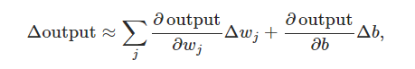

Link
===============

http://neuralnetworksanddeeplearning.com/chap1.html

https://www.youtube.com/watch?v=IHZwWFHWa-w

https://www.youtube.com/watch?v=sDv4f4s2SB8

Notes
===============
1. When we try to express the problem-solving algorithmically, with rules precise. We find a lot of exceptions there.
   Neural networks approach the problem in a different way. It uses a lot of examples to automatically infer rules for 
   problem-solving
2. How do perceptron work
   1. A perceptron takes several binary inputs, and produces a single binary output.
      The neuron's output, 0 or 1, is determined by whether the weighted sum is less than or greater than some 
      threshold value.
      
   2. we can use perceptrons to model decision-making process. We can sign different neurons different weights, 
      so in decision-making process, it represents the importance of certain features.
   3. more complex and subtle decisions can be made by multiple layers in perceptron. 
   4. Let's simplify the way we describe perceptrons. The condition threshold is cumbersome, 
      and we can make two notational changes to simplify it. The first change is to write as a 
      dot product, where w and x are vectors whose components are the weights and inputs, 
      respectively. The second change is to move the threshold to the other side of the inequality, 
      and to replace it by what's known as the perceptron's bias, b≡−threshold. Using the bias instead 
      of the threshold, the perceptron rule can be rewritten:
      
   5. You can think of the bias as a measure of how easy it is to get the perceptron to output a 1. Or 
      to put it in more biological terms, the bias is a measure of how easy it is to get the perceptron to fire. 
   6. Perceptron can also be used to compute simple logical functions.
3. The computational universality of perceptrons is simultaneously reassuring and disappointing. 
   It's reassuring because it tells us that networks of perceptrons can be as powerful as any other 
   computing device. But it's also disappointing, because it makes it seem as though perceptrons are 
   merely a new type of NAND gate. However, Instead of explicitly laying out a circuit of NAND and other gates,
   our neural networks can simply learn to solve problems, sometimes problems where it would be extremely 
   difficult to directly design a conventional circuit.
4. A small change in the weights or bias of any single perceptron in the network can sometimes cause the 
   output of that perceptron to completely flip, say from 0 to 1. We can overcome this problem by introducing 
   a new type of artificial neuron called a sigmoid neuron. Sigmoid neurons are similar to perceptrons, 
   but modified so that small changes in their weights and bias cause only a small change in their output.
   1. Just like a perceptron, the sigmoid neuron has inputs, x1,x2,…. But instead of being just 0 or 1, 
      these inputs can also take on any values between 0 and 1. So, for instance, 0.638… is a valid input 
      for a sigmoid neuron. Also just like a perceptron, the sigmoid neuron has weights for each input, 
      w1,w2,…, and an overall bias, b. But the output is not 0 or 1. Instead, it's σ(w⋅x+b), where σ 
      is called the sigmoid function, and is defined by:
      
   2. The perceptron model is similar to the sigmoid neuron when the numbers are really large or really small.
      The main differences appear when the wx + b is of modest size.
      
   3. If σ had in fact been a step function, then the sigmoid neuron would be a perceptron, since the output 
      would be 1 or 0 depending on whether wx + b was positive or negative. By using the actual σ function we get, 
      a smoothed out perceptron. Indeed, it's the smoothness of the σ function that is the crucial fact, not
      its detailed form. he smoothness of σ means that small changes Δwj in the weights and Δb in the bias 
      will produce a small change Δoutput in the output from the neuron. In fact, calculus tells us that
      Δoutput is well approximated by
      
      Δoutput  is a linear function of the changes Δwj and Δb in the weights and bias.
5. You might wonder why we use 10 output neurons. After all, the goal of the network is to tell us which 
   digit (0,1,2,…,9) corresponds to the input image. A seemingly natural way of doing that is to use just 
   4 output neurons, treating each neuron as taking on a binary value, depending on whether the neuron's
   output is closer to 0 or to 1. Four neurons are enough to encode the answer, since 24=16 is more than 
   the 10 possible values for the input digit. Why should our network use 10 neurons instead? Isn't that
   inefficient? The ultimate justification is empirical: we can try out both network designs, and it turns 
   out that, for this particular problem, the network with 10 output neurons learns to recognize digits 
   better than the network with 4 output neurons. But that leaves us wondering why using 10 output neurons
   works better. Is there some heuristic that would tell us in advance that we should use the 10-output 
   encoding instead of the 4-output encoding?
   
   To understand why we do this, it helps to think about what the neural network is doing from first 
   principles. Consider first the case where we use 10 output neurons. Let's concentrate on the first
   output neuron, the one that's trying to decide whether or not the digit is a 0. It does this by 
   weighing up evidence from the hidden layer of neurons. What are those hidden neurons doing? Well,
   just suppose for the sake of argument that the first, second, third and fourth neuron in the hidden layer 
   detects whether or not an image like the following is present:
   
   So if all four of these hidden neurons are firing then we can conclude that the digit is a 0. Of course, 
   that's not the only sort of evidence we can use to conclude that the image was a 0 - we could legitimately
   get a 0 in many other ways (say, through translations of the above images, or slight distortions). 
   But it seems safe to say that at least in this case we'd conclude that the input was a 0.
6. In other words, we want to find a set of weights and biases which make the cost as small as possible.
   We'll do that using an algorithm known as gradient descent.
7. Why introduce the quadratic cost? After all, aren't we primarily interested in the number of images 
   correctly classified by the network? Why not try to maximize that number directly, rather than
   minimizing a proxy measure like the quadratic cost? The problem with that is that the number of 
   images correctly classified is not a smooth function of the weights and biases in the network.
   For the most part, making small changes to the weights and biases won't cause any change at all
   in the number of training images classified correctly. That makes it difficult to figure out how 
   to change the weights and biases to get improved performance. If we instead use a smooth cost function
   like the quadratic cost it turns out to be easy to figure out how to make small changes in the weights
   and biases so as to get an improvement in the cost. That's why we focus first on minimizing the quadratic
   cost, and only after that will we examine the classification accuracy.
8. Thinking about we can't really explain the weights and bias generated from the neural network automatically, 
   The end result is a network which breaks down a very complicated question - does this image show a face or
   not - into very simple questions answerable at the level of single pixels. It does this through a series
   of many layers, with early layers answering very simple and specific questions about the input image, 
   and later layers building up a hierarchy of ever more complex and abstract concepts. Networks with this
   kind of many-layer structure - two or more hidden layers - are called deep neural networks.
   

Thoughts
===============
1. if the perceptron simulate a decision-making process. Why a perceptron will give a confident wrong prediction
   on a completely obscure picture when doing number recognition.
2. exactly how many features there are for decision-making?
3. using matrix instead of numbers or vector is the way how we further improve our neural networks?
4. nothing is too true or false, nothing is too positive or negative, just like the difference between perceptron
   and sigmoid neuron. That's how human make decision and be logical?
5. by putting even water to a valley, we can't make sure the water goes to the global minimum, however, put
   the valley up-side-down on the water, the water could reach the global maximum, is this a way that could 
   probably solve the hard-to-find global minimum issue? put it from the side, horizontally, might be more 
   efficient?
6. I don't know how the quantum computer works, what if it could be used in neural network?

Summary
===============
Some problems are really hard to manually make rules to solve. That's where the perceptron comes out. 
Instead of letting human write the rules or algorithm, the perceptron automatically write the rules or algorithm
during the training process. As perceptron could be used to represent NAND gate, it is able to represent all kinds
of computation process. the advantage of using perceptron is we don't necessary need to explicitly design
the computation process. One of the main problem with perceptron is, small changes will make big different, in other
word, the perceptron is really not stable. The sigmoid neurons come to mitigate this issue by assigning a smooth
transition from negative to positive, instead of giving 0 or 1 only. 
In the book, author made an example of recognizing handwriting numbers from 0-9. Instead of using 4 output 
neurons, why we use 10? 4 neurons can make 16 possible results as each neuron could represent 0 or 1. From
the experience, the 10 output does make better performance, but why? The way author explained in the book
is the 10 output neurons could probably store more image features? As author mentioned, this is all heuristic, 
and this is not an accurate answer. 
After setting up the network, we need to consider about the lost. Question about why not just seeing if the 
output is correct or not for the loss function, but using more complex quadratic cost function? It could be explained
like the difference between sigmoid and step function. Turing 0 to 1 is obvious, but too large to measure the 
detail in it. 
For gradient descent, I am not fully understand the calculating process. From my superficial understanding, 
the gradient descent algorithm use partial deritive to calculate the slope, and to make the slope as small as
possible. 