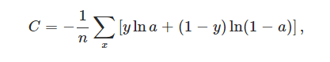
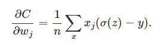

Link
===============

http://neuralnetworksanddeeplearning.com/chap3.html

Notes
===============
1. The cross-entropy cost function
   1. Contrast with human learning process, seems like the neural network learn much slower when it occurs obvious
      mistake.
   2. To understand the origin of the problem, consider that our neuron learns by changing the weight and bias 
      at a rate determined by the partial derivatives of the cost function, ∂C/∂w and ∂C/∂b. So saying "learning 
      is slow" is really the same as saying that those partial derivatives are small.
   3. By solving the learning slowdown issue, cross-entropy cost function is introduced
      
      Two properties in particular make it reasonable to interpret the cross-entropy as a cost function. 
      First, it's non-negative, that is, C>0. To see this, notice that: (a) all the individual terms 
      in the sum in (57) are negative, since both logarithms are of numbers in the range 0 to 1; and (b) 
      there is a minus sign out the front of the sum.
      Second, if the neuron's actual output is close to the desired output for all training inputs, x, then 
      the cross-entropy will be close to zero. To see this, suppose for example that y = 0 and a ≈ 0 for
      some input x. This is a case when the neuron is doing a good job on that input. We see that the first 
      term in the expression for the cost vanishes, since y = 0, while the second term is just −ln(1−a)≈0. 
      A similar analysis holds when y=1 and a≈1. And so the contribution to the cost will be low provided 
      the actual output is close to the desired output.
   4. Summing up, the cross-entropy is positive, and tends toward zero as the neuron gets better at computing 
      the desired output, y, for all training inputs, x. These are both properties we'd intuitively expect 
      for a cost function. 
      
      This is a beautiful expression. It tells us that the rate at which the weight learns is controlled by
      σ(z)−y, i.e., by the error in the output. The larger the error, the faster the neuron will learn. 
      This is just what we'd intuitively expect. In particular, it avoids the learning slowdown caused 
      by the σ′(z) term in the analogous equation for the quadratic cost, Equation (55). When we use the 
      cross-entropy, the σ′(z) term gets canceled out, and we no longer need worry about it being small.

Thoughts
===============

Summary
===============
