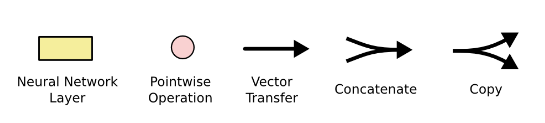
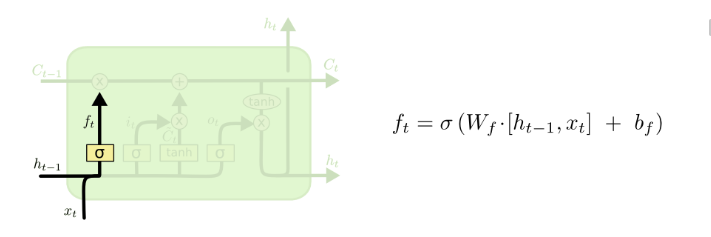
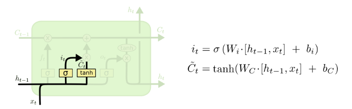
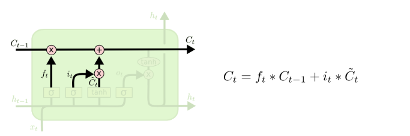
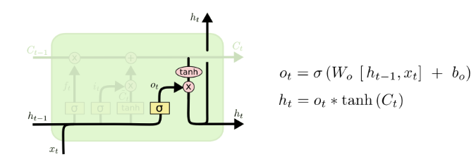

Link
===============

http://colah.github.io/posts/2015-08-Understanding-LSTMs/

https://towardsdatascience.com/word-level-english-to-marathi-neural-machine-translation-using-seq2seq-encoder-decoder-lstm-model-1a913f2dc4a7

Notes
===============

1. But there are also cases where we need more context. Consider trying to predict the last word in the text “I grew up
   in France… I speak fluent French.” Recent information suggests that the next word is probably the name of a language,
   but if we want to narrow down which language, we need the context of France, from further back. It’s entirely
   possible for the gap between the relevant information and the point where it is needed to become very large.
   Unfortunately, as that gap grows, RNNs become unable to learn to connect the information.
   
2. The first step in our LSTM is to decide what information we’re going to throw away from the cell state. This decision
   is made by a sigmoid layer called the “forget gate layer.”It looks at ht−1 and xt, and outputs a number between 0 and
   1 for each number in the cell state Ct−1. A 1 represents “completely keep this” while a 0 represents “completely get
   rid of this.”
   
3. The next step is to decide what new information we’re going to store in the cell state. This has two parts. First, a
   sigmoid layer called the “input gate layer” decides which values we’ll update. Next, a tanh layer creates a vector of
   new candidate values, C~t, that could be added to the state. In the next step, we’ll combine these two to create an
   update to the state.
   
4. We multiply the old state by ft, forgetting the things we decided to forget earlier. Then we add it∗C~t. This is the
   new candidate values, scaled by how much we decided to update each state value.
   
5. Finally, we need to decide what we’re going to output. This output will be based on our cell state, but will be a
   filtered version. First, we run a sigmoid layer which decides what parts of the cell state we’re going to output.
   Then, we put the cell state through tanh (to push the values to be between −1 and 1) and multiply it by the output of
   the sigmoid gate, so that we only output the parts we decided to.
   
6. Here we introduce an encoder-decoder structure with LSTM:
    1. Both encoder and the decoder are typically LSTM models (or sometimes GRU models)
    2. Encoder reads the input sequence and summarizes the information in something called as the internal state vectors
       (in case of LSTM these are called as the hidden state and cell state vectors). We discard the outputs of the
       encoder and only preserve the internal states.
    3. Decoder is an LSTM whose initial states are initialized to the final states of the Encoder LSTM. Using these
       initial states, decoder starts generating the output sequence.
    4. The decoder behaves a bit differently during the training and inference procedure. During the training, we use a
       technique call teacher forcing which helps to train the decoder faster. During inference, the input to the
       decoder at each time step is the output from the previous time step.
    5. Intuitively, the encoder summarizes the input sequence into state vectors (sometimes also called as Thought
       vectors), which are then fed to the decoder which starts generating the output sequence given the Thought
       vectors. The decoder is just a language model conditioned on the initial states.

Thoughts
===============

1. memory (cover & update)
    1. LSTM can be a good inspiration for the chatbot memory component. Learn when to forget and update memory.
2. How to exactly define language model?
    1. Having the ability to comprehend or generate the words or sentence?
    2. Using huge language dataset, with unsupervised learning method to train on Transformers models, it could be
       encoder-decoder, encoder only or decoder only structure.

Summary
===============
LSTM stands for long short term memory. Similar to RNN, it is composed of a list of neural networks. However, instead of
storing all the previous information into a huge embeddings, LSTM is able to decide which information the model is going
to remember. By forgetting and updating the previous knowledge, LSTM model is better at correctly using the accurate
memory, instead of using all the memories that are mixed together.