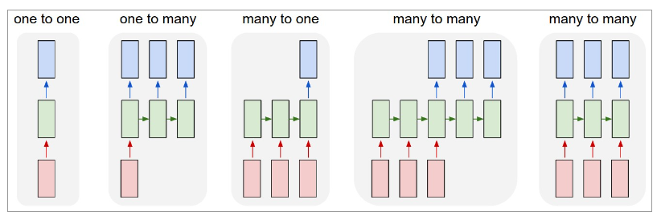
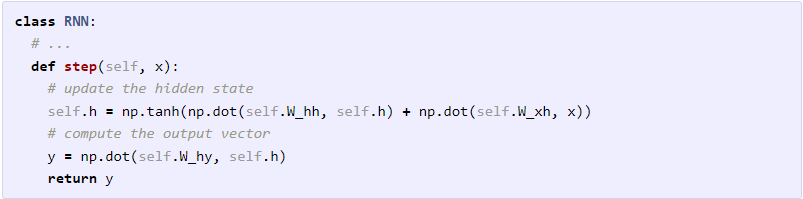
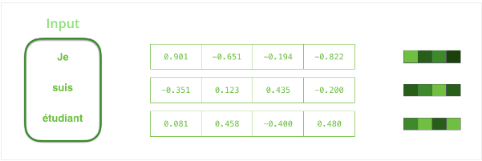

Link
===============

http://karpathy.github.io/2015/05/21/rnn-effectiveness/

https://jalammar.github.io/visualizing-neural-machine-translation-mechanics-of-seq2seq-models-with-attention/

https://www.youtube.com/watch?v=UNmqTiOnRfg

Notes
===============

1. A glaring limitation of Vanilla Neural Networks (and also Convolutional Networks) is that their API is too
   constrained: they accept a fixed-sized vector as input (e.g. an image) and produce a fixed-sized vector as output (
   e.g. probabilities of different classes).Not only that:
   These models perform this mapping using a fixed amount of computational steps (e.g. the number of layers in the
   model). The core reason that recurrent nets are more exciting is that they allow us to operate over sequences of
   vectors: Sequences in the input, the output, or in the most general case both. A few examples may make this more
   concrete:
   
2. The RNN class has some internal state that it gets to update every time step is called. In the simplest case this
   state consists of a single hidden vector h. Here is an implementation of the step function in a Vanilla RNN:
   
   This RNN’s parameters are the three matrices W_hh, W_xh, W_hy. The hidden state self.h is initialized with the zero
   vector. The np.tanh function implements a non-linearity that squashes the activations to the range [-1, 1]. Notice
   briefly how this works: There are two terms inside of the tanh: one is based on the previous hidden state and one is
   based on the current input. In numpy np.dot is matrix multiplication. The two intermediates interact with addition,
   and then get squashed by the tanh into the new state vector.
3. The encoder processes each item in the input sequence, it compiles the information it captures into a vector (called
   the context). After processing the entire input sequence, the encoder sends the context over to the decoder, which
   begins producing the output sequence item by item.
4. By design, an RNN takes two inputs at each time step: an input (in the case of the encoder, one word from the input
   sentence), and a hidden state.
5. We need to turn the input words into vectors before processing them. That transformation is done using a word
   embedding algorithm. We can use pre-trained embeddings or train our own embedding on our dataset. Embedding vectors
   of size 200 or 300 are typical.
   

Thoughts
===============

1. after every certain number of iterations of training, seems like the model learns certain features.

Summary
===============
RNN stands for recurrent neural network. Two key improvements of RNN is.

1. it accepts sequence as input and sequence as output, and the length of the sequence could be changed accordingly.
2. RNN could store information from previous vectors or embeddings. by using tanh as activation, multiple and adding
   vector operations, the model is able to adding the previous information and utilize the information for the next
   output.
3. RNN is one of the first sequence to sequence models, encoder-decoder model could use RNN.
4. RNN is composed of a bunch of parallel neural network, from left to right, and they keep the information from the
   previous neural network. 