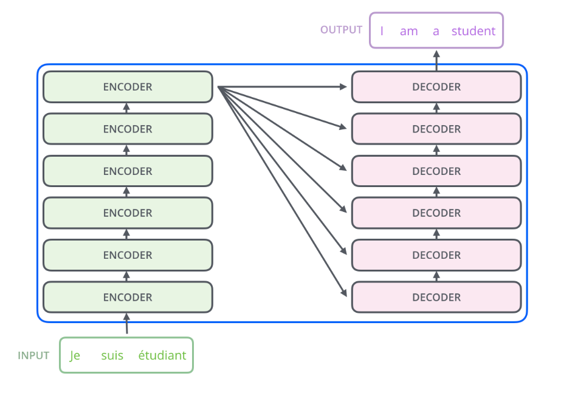
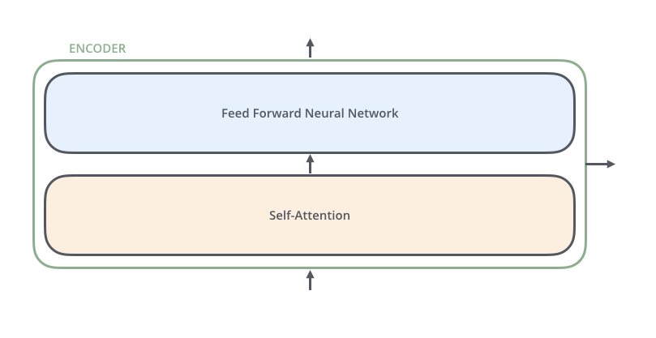
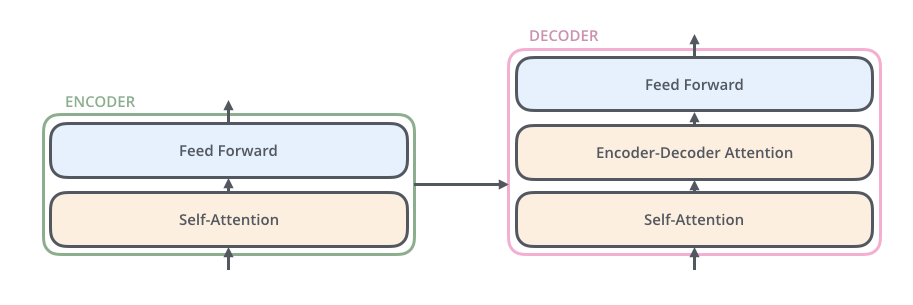
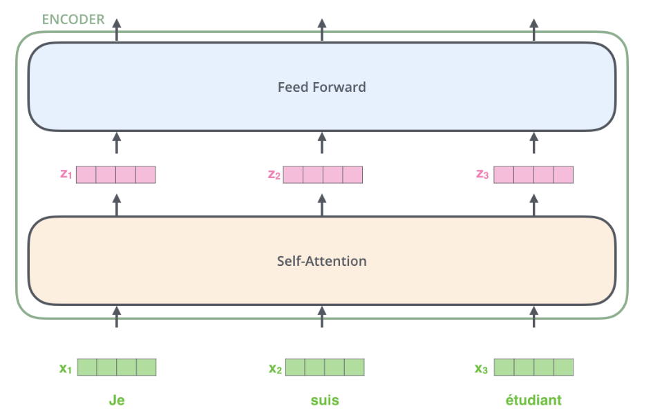

Link
===============

https://blog.floydhub.com/the-transformer-in-pytorch/#multi-headed-attention

https://blog.floydhub.com/attention-mechanism/#:~:text=When%20we%20think%20about%20the,factors%20when%20processing%20the%20data.

https://jalammar.github.io/illustrated-transformer/

https://jalammar.github.io/visualizing-neural-machine-translation-mechanics-of-seq2seq-models-with-attention/

https://www.youtube.com/watch?v=UNmqTiOnRfg

Notes
===============
1. The context vector turned out to be a bottleneck for these types of models. It made it challenging
   for the models to deal with long sentences. A solution was proposed in Bahdanau et al.,
   2014 and Luong et al., 2015. These papers introduced and refined a technique called
   “Attention”, which highly improved the quality of machine translation systems.
   Attention allows the model to focus on the relevant parts of the input sequence as needed.
2. An attention model differs from a classic sequence-to-sequence model in two main ways:
   1. First, the encoder passes a lot more data to the decoder. Instead of passing the last hidden
      state of the encoding stage, the encoder passes all the hidden states to the decoder:
      
   2. Second, an attention decoder does an extra step before producing its output. In order to
      focus on the parts of the input that are relevant to this decoding time step,
      the decoder does the following:
      1. Look at the set of encoder hidden states it received – each encoder hidden state is most
         associated with a certain word in the input sentence
      2. Give each hidden state a score (let’s ignore how the scoring is done for now)
      3. Multiply each hidden state by its softmaxed score, thus amplifying hidden states with high
         scores, and drowning out hidden states with low scores
         
3. how exactly the attention process works:
   1. The attention decoder RNN takes in the embedding of the <END> token, and an initial decoder hidden state. 
   2. The RNN processes its inputs, producing an output and a new hidden state vector (h4). 
      The output is discarded.
   3. Attention Step: We use the encoder hidden states and the h4 vector to calculate a context vector
      (C4) for this time step.
   4. We concatenate h4 and C4 into one vector. 
   5. We pass this vector through a feedforward neural network (one trained jointly with the model). 
   6. The output of the feedforward neural networks indicates the output word of this time step. 
   7. Repeat for the next time steps
      

Thoughts
===============
1. why the attention mechanism happened in the last step instead of every decoder steps? 
   1. I was wrong

2. why attention mechanism is better than RNN (LSTM)? 
   1. LSTM know what knowledge to keep or update, maybe there is still a small chance it deletes the key information 
      that will be needed in the future?
   2. In the opposite, attention mechanism doesn't forget or update things. It keeps all the information
      and just use a clever way to use them. 

3. how do people came up with attention mechanism?
   1. is it because they notice human has this kind of attention or characteristic?
   2. is so, what else characteristic human are better than the machine?

Summary
===============
attention mechanism is one key component in Transformers, and is a great way to further improve sequence 
to sequence architecture in deep learning. it gives different parts of sequence different score to 
represent its focus degree and appropriately use that information in the decoder. The attention decoder
RNN doesn't just give output like normal decoder RNN. Instead, it skips the output, only use the hidden 
vectors generated from the normal decoder. And then, combine the output hidden state vector with the all original
encoder hidden states, a new context vector is generated. With the new context vector as input, a feedforward 
neural network is used to generated output. This output is the final representation of the output word. By
re-doing these steps on every word, this is how attention mechanism works. 
