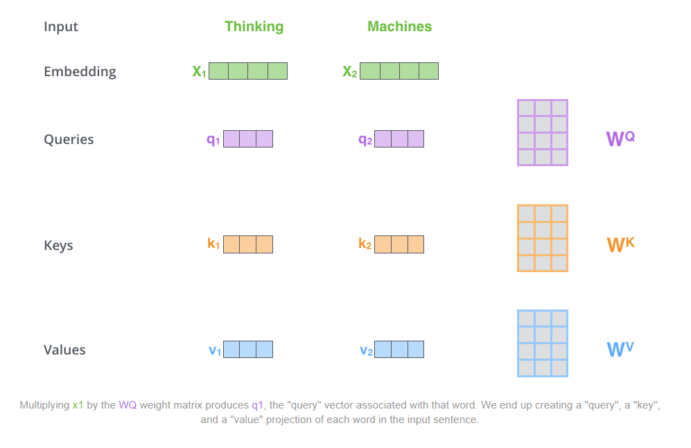

Link
===============

https://jalammar.github.io/illustrated-tra

http://nlp.seas.harvard.edu/2018/04/03/attention.html

Notes
===============
1. The biggest benefit, however, comes from how The Transformer lends itself to parallelization.
2. here is the architecture of the transformer model in the paper <Attention is all you need>:
   
   The encoders are all identical in structure (yet they do not share weights).
   Each one is broken down into two sub-layers:
   
   The decoder has both those layers, but between them is an attention layer that helps the decoder
   focus on relevant parts of the input sentence (similar what attention does in seq2seq models).
   
3. As is the case in NLP applications in general, we begin by turning each input word into a vector
   using an embedding algorithm. The embedding only happens in the bottom-most encoder.
   The abstraction that is common to all the encoders is that they receive a list of vectors each
   of the size 512 – In the bottom encoder that would be the word embeddings, but in other encoders,
   it would be the output of the encoder that’s directly below. The size of this list is hyperparameter
   we can set – basically it would be the length of the longest sentence in our training dataset.
   After embedding the words in our input sequence, each of them flows through each of the two layers
   of the encoder. and we see that the word in each position flows through its own path in the decoder.
   In other word, there are dependencies between these paths in the self-attention layer.
   The feed-forward layer does not have those dependencies, however, and thus the various
   paths can be executed in parallel while flowing through the feed-forward layer.
   
4. Self-attention is the method the Transformer uses to bake the “understanding” of other relevant
   words into the one we’re currently processing.
   
5. How to calculate self-attention using vectors.
   1. The first step in calculating self-attention is to create three vectors from each of the encoder’s
      input vectors (in this case, the embedding of each word).So for each word, we create a Query vector,
      a Key vector, and a Value vector. These vectors are created by multiplying the embedding by
      three matrices that we trained during the training process. Notice that these new vectors are
      smaller in dimension than the embedding vector. Their dimensionality is 64, while the embedding
      and encoder input/output vectors have dimensionality of 512. They don’t HAVE to be smaller,
      this is an architecture choice to make the computation of multiheaded attention (mostly) constant.
      
   2. The second step in calculating self-attention is to calculate a score. Say we’re calculating
      the self-attention for the first word in this example, “Thinking”. We need to score each word
      of the input sentence against this word. The score determines how much focus to place on
      other parts of the input sentence as we encode a word at a certain position. The score is calculated
      by taking the dot product of the query vector with the key vector of the respective word we’re
      scoring. So if we’re processing the self-attention for the word in position #1, the first
      score would be the dot product of q1 and k1. The second score would be the dot product of q1 and k2.
      
      The third and fourth steps are to divide the scores by 8 (the square root of the dimension of the key
      vectors used in the paper – 64. This leads to having more stable gradients. There could be other
      possible values here, but this is the default), then pass the result through a softmax operation.
      Softmax normalizes the scores so they’re all positive and add up to 1.
      
      This softmax score determines how much each word will be expressed at this position.
      Clearly the word at this position will have the highest softmax score, but sometimes it’s useful
      to attend to another word that is relevant to the current word.
   3. The fifth step is to multiply each value vector by the softmax score (in preparation to sum them up).
      The intuition here is to keep intact the values of the word(s) we want to focus on, and drown-out
      irrelevant words (by multiplying them by tiny numbers like 0.001, for example).
   4. The sixth step is to sum up the weighted value vectors. This produces the output of the self-attention
      layer at this position (for the first word).
      
      That concludes the self-attention calculation. The resulting vector is one we can send along to
      the feed-forward neural network. In the actual implementation, however, this calculation is done
      in matrix form for faster processing. So let’s look at that now that we’ve seen the intuition of
      the calculation on the word level.
6. For faster processing, transformers use matrix to represent the whole sequences instead of vector to represent
   each word.
   
   Every row in the X matrix corresponds to a word in the input sentence. We again see the difference 
   in size of the embedding vector (512, or 4 boxes in the figure), and the q/k/v vectors (64, or 3 boxes
   in the figure)
   Finally, since we’re dealing with matrices, we can condense steps two through six in one formula to
   calculate the outputs of the self-attention layer.
   
7. “multi-headed” attention improves the performance of the attention layer in two ways:
   1. It expands the model’s ability to focus on different positions. Yes, in the example above, 
      z1 contains a little bit of every other encoding, but it could be dominated by the the actual
      word itself. It would be useful if we’re translating a sentence like “The animal didn’t cross 
      the street because it was too tired”, we would want to know which word “it” refers to.
   2. It gives the attention layer multiple “representation subspaces”. As we’ll see next, with 
      multi-headed attention we have not only one, but multiple sets of Query/Key/Value weight 
      matrices (the Transformer uses eight attention heads, so we end up with eight sets for each 
      encoder/decoder). Each of these sets is randomly initialized. Then, after training, each set 
      is used to project the input embeddings (or vectors from lower encoders/decoders) into a different 
      representation subspace.
   

Thoughts
===============
1. why multipling each value vector with the softmax score is able to keep intact the values of the word?
   1. as self-attention not only output the attention attribute but also the word information itself, 
      so having a value vector to represent its word information should be important
2. what is sum up means in the sixth step? 
   1. add all vectors numbers together or just simply combine all vector parallel together?
3. how fast can it be to use matrix instead of vectors?
4. why eight heads? Is it a magic number?
5. why multiple heads is able to expand the model's ability to focus on different positions?

Summary
===============
